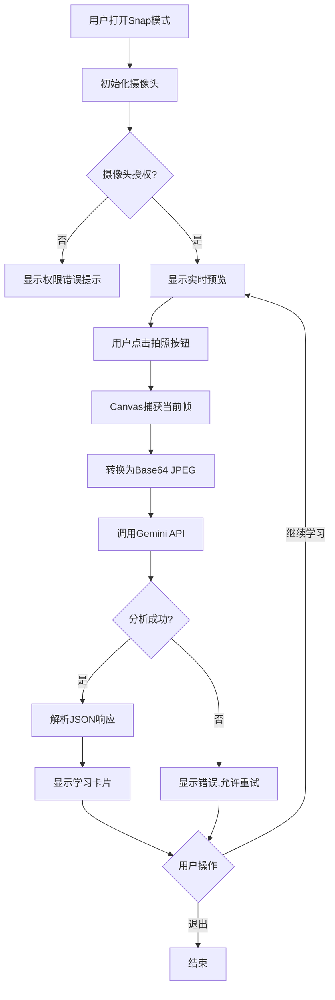
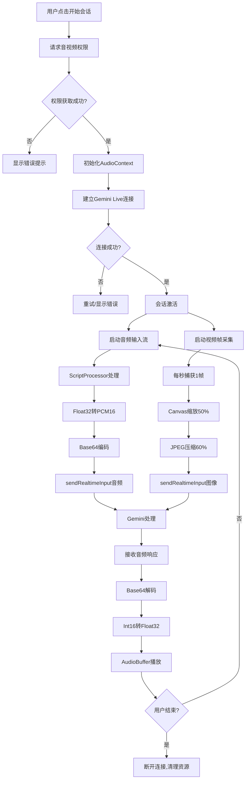
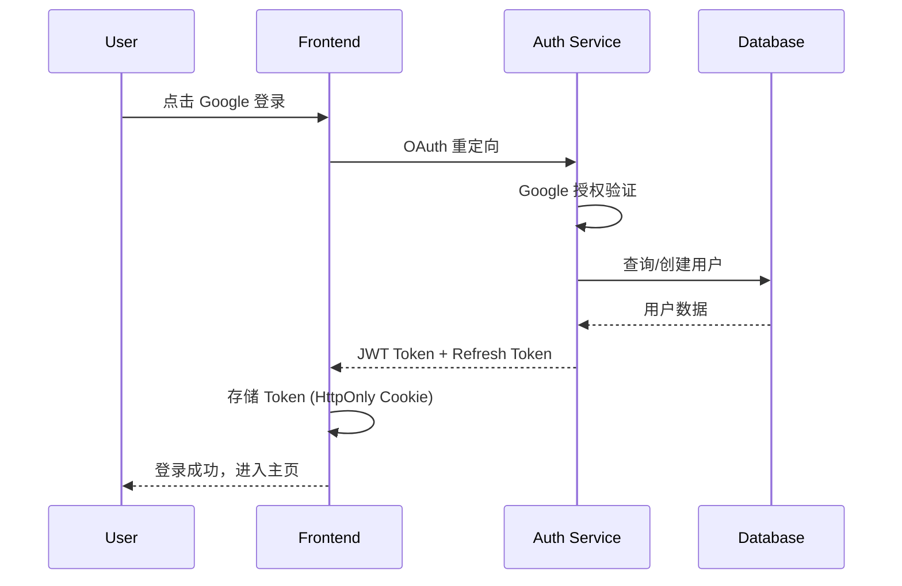
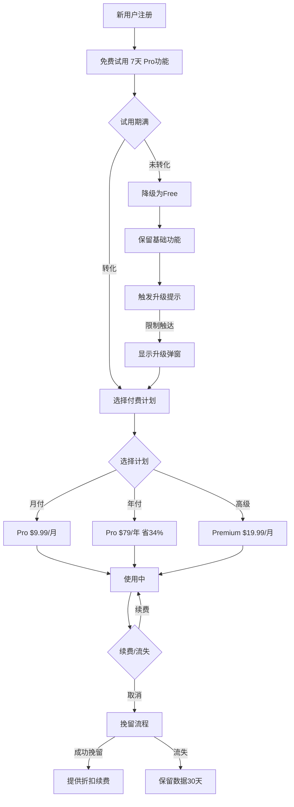

# LinguaLens 中文学习应用技术方案

> 一款面向外国人的智能中文学习应用，通过AI视觉识别和实时语音交互，让中文学习变得有趣、轻松、高效。

---

## 目录

1. [产品概述](#1-产品概述)
2. [系统架构](#2-系统架构)
3. [核心功能详解](#3-核心功能详解)
4. [用户界面原型](#4-用户界面原型)
5. [技术实现方案](#5-技术实现方案)
6. [用户账户系统](#6-用户账户系统)
7. [商业模式与付费方案](#7-商业模式与付费方案)
8. [功能优化建议](#8-功能优化建议)
9. [开发路线图](#9-开发路线图)
10. [待讨论问题](#10-待讨论问题)aC l

---

## 1. 产品概述

### 1.1 产品定位

| 维度 | 描述 |
|------|------|
| **产品名称** | LinguaLens (语言透镜) |
| **核心理念** | "所见即所学" - 将真实世界变成中文课堂 |
| **目标市场** | 全球中文学习者 |
| **核心技术** | Google Gemini AI + 实时音视频 |

### 1.2 目标用户画像

> **核心用户**: 来华商务旅行的外国人 (Business Travelers & Tourists)

```
┌──────────────────────────────────────────────────────────────────────────────┐
│                         目标用户优先级金字塔                                   │
├──────────────────────────────────────────────────────────────────────────────┤
│                                                                              │
│                              ┌─────────┐                                     │
│                              │  P0     │                                     │
│                              │ 商务    │  ← 核心用户：来华出差的外企高管/销售   │
│                            ┌─┴─────────┴─┐                                   │
│                            │    P0       │                                   │
│                            │  旅行者     │  ← 核心用户：来华旅游的外国游客       │
│                          ┌─┴─────────────┴─┐                                 │
│                          │      P1         │                                 │
│                          │   外派驻华      │  ← 次要用户：长期驻华工作人员       │
│                        ┌─┴─────────────────┴─┐                               │
│                        │        P2           │                               │
│                        │   海外中文学习者    │  ← 拓展用户：海外大学生/爱好者     │
│                        └─────────────────────┘                               │
│                                                                              │
└──────────────────────────────────────────────────────────────────────────────┘
```

#### 核心用户详细画像

| 用户类型 | 典型场景 | 核心痛点 | 付费意愿 | 使用频率 |
|---------|---------|---------|---------|---------|
| **商务出差** 👔 | 会议、商务宴请、工厂参观 | 无法与本地同事/客户基础沟通 | ⭐⭐⭐⭐⭐ 高 | 出差前/中集中使用 |
| **高端旅行者** ✈️ | 自由行、美食探店、文化体验 | 点餐/问路/购物困难 | ⭐⭐⭐⭐ 中高 | 旅行期间高频 |
| **外派驻华** 🏢 | 日常生活、同事交流 | 长期生活沟通不便 | ⭐⭐⭐⭐⭐ 高 | 长期稳定使用 |
| **海外学习者** 🎓 | 课外练习、备考HSK | 缺乏实景练习机会 | ⭐⭐⭐ 中 | 日常学习 |

#### 用户旅程地图 (Business Traveler)

```
┌──────────────────────────────────────────────────────────────────────────────┐
│                    商务旅行者用户旅程 (User Journey Map)                       │
├──────────────────────────────────────────────────────────────────────────────┤
│                                                                              │
│  出发前              抵达机场           酒店入住          商务场景            │
│  ────────           ────────           ────────          ────────            │
│                                                                              │
│  ┌─────────┐       ┌─────────┐       ┌─────────┐       ┌─────────┐          │
│  │ 下载App  │  →   │ 出租车   │  →   │ 前台对话 │  →   │ 会议寒暄 │          │
│  │ 快速上手 │       │ 告诉目的地│       │ 办理入住 │       │ 基础问候 │          │
│  └─────────┘       └─────────┘       └─────────┘       └─────────┘          │
│       │                 │                 │                 │                │
│       ▼                 ▼                 ▼                 ▼                │
│  ┌─────────┐       ┌─────────┐       ┌─────────┐       ┌─────────┐          │
│  │Live练习 │       │Snap拍照 │       │情景对话 │       │商务词汇 │          │
│  │ 发音    │       │ 学中文  │       │ 模拟   │       │ 学习   │          │
│  └─────────┘       └─────────┘       └─────────┘       └─────────┘          │
│                                                                              │
│  餐厅用餐            购物场景           返程途中          持续学习            │
│  ────────           ────────           ────────          ────────            │
│                                                                              │
│  ┌─────────┐       ┌─────────┐       ┌─────────┐       ┌─────────┐          │
│  │ 看菜单   │  →   │ 砍价/   │  →   │ 复习    │  →   │ 续费    │          │
│  │ 点餐    │       │ 结账    │       │ 所学词汇 │       │ 准备下次 │          │
│  └─────────┘       └─────────┘       └─────────┘       └─────────┘          │
│       │                 │                 │                 │                │
│       ▼                 ▼                 ▼                 ▼                │
│  ┌─────────┐       ┌─────────┐       ┌─────────┐       ┌─────────┐          │
│  │Snap菜品 │       │Snap商品 │       │词汇本   │       │订阅续费 │          │
│  │ 学食物  │       │ 学商品  │       │ 复习   │       │ 解锁更多 │          │
│  └─────────┘       └─────────┘       └─────────┘       └─────────┘          │
│                                                                              │
└──────────────────────────────────────────────────────────────────────────────┘
```

### 1.3 核心价值主张

| 传统学习方式 | LinguaLens 方式 |
|-------------|----------------|
| 死记硬背单词卡 | 📸 拍照即学，实物关联记忆 |
| 发音无反馈 | 🎤 AI实时纠正发音 |
| 缺乏语境 | 💬 智能生成实用例句 |
| 学习枯燥 | 🎮 游戏化激励机制 |
| 进度不可见 | 📊 可视化学习轨迹 |

---

## 2. 系统架构

### 2.1 整体架构图

```
┌──────────────────────────────────────────────────────────────────────────┐
│                           LinguaLens 系统架构                              │
├──────────────────────────────────────────────────────────────────────────┤
│                                                                          │
│  ┌─────────────────────────────────────────────────────────────────┐    │
│  │                        前端层 (Frontend)                         │    │
│  │  ┌─────────────┐  ┌─────────────┐  ┌─────────────────────────┐  │    │
│  │  │   React 19  │  │ Tailwind CSS│  │    Lucide React Icons   │  │    │
│  │  └─────────────┘  └─────────────┘  └─────────────────────────┘  │    │
│  │  ┌─────────────────────────────────────────────────────────────┐│    │
│  │  │              TypeScript + Vite 构建工具                      ││    │
│  │  └─────────────────────────────────────────────────────────────┘│    │
│  └─────────────────────────────────────────────────────────────────┘    │
│                                    │                                     │
│                                    ▼                                     │
│  ┌─────────────────────────────────────────────────────────────────┐    │
│  │                       设备能力层 (Device APIs)                    │    │
│  │  ┌──────────────┐  ┌──────────────┐  ┌────────────────────┐    │    │
│  │  │ MediaDevices │  │ AudioContext │  │  Canvas API        │    │    │
│  │  │  (摄像头)     │  │  (音频处理)   │  │  (图像捕获)         │    │    │
│  │  └──────────────┘  └──────────────┘  └────────────────────┘    │    │
│  └─────────────────────────────────────────────────────────────────┘    │
│                                    │                                     │
│                                    ▼                                     │
│  ┌─────────────────────────────────────────────────────────────────┐    │
│  │                        AI 服务层 (Gemini AI)                      │    │
│  │  ┌─────────────────────────┐  ┌─────────────────────────────┐  │    │
│  │  │   Gemini 2.5 Flash      │  │  Gemini Live API            │  │    │
│  │  │   (静态图像分析)         │  │  (实时音视频交互)            │  │    │
│  │  │   • 物体识别             │  │  • 双向语音流                │  │    │
│  │  │   • 结构化JSON输出       │  │  • 实时视频帧分析            │  │    │
│  │  └─────────────────────────┘  └─────────────────────────────┘  │    │
│  └─────────────────────────────────────────────────────────────────┘    │
│                                                                          │
└──────────────────────────────────────────────────────────────────────────┘
```

### 2.2 技术栈详情

| 层级 | 技术选型 | 版本 | 用途 |
|------|---------|------|------|
| **框架** | React | 19.2.1 | UI组件构建 |
| **语言** | TypeScript | 5.8.2 | 类型安全 |
| **构建** | Vite | 6.2.0 | 开发服务器&打包 |
| **样式** | Tailwind CSS | CDN | 原子化CSS |
| **字体** | Noto Serif SC | - | 中文显示 |
| **图标** | Lucide React | 0.556.0 | UI图标 |
| **AI** | @google/genai | 1.31.0 | Gemini API客户端 |

### 2.3 数据流向图

```
                          ┌─────────────────┐
                          │   用户操作       │
                          └────────┬────────┘
                                   │
                    ┌──────────────┴──────────────┐
                    ▼                              ▼
          ┌─────────────────┐            ┌─────────────────┐
          │  Snap 模式       │            │  Live 模式       │
          │  (拍照学习)      │            │  (实时对话)      │
          └────────┬────────┘            └────────┬────────┘
                   │                              │
                   ▼                              ▼
          ┌─────────────────┐            ┌─────────────────┐
          │ 1. 摄像头捕获    │            │ 1. 建立WebSocket │
          │ 2. Canvas绘制   │            │ 2. 音频流编码    │
          │ 3. Base64编码   │            │ 3. 视频帧采样    │
          └────────┬────────┘            └────────┬────────┘
                   │                              │
                   ▼                              ▼
          ┌─────────────────┐            ┌─────────────────┐
          │  Gemini Flash   │            │  Gemini Live    │
          │  generateContent│            │  实时双向流      │
          └────────┬────────┘            └────────┬────────┘
                   │                              │
                   ▼                              ▼
          ┌─────────────────┐            ┌─────────────────┐
          │ JSON 结构化响应  │            │ PCM音频流响应    │
          │ • chinese       │            │ • 24kHz采样率   │
          │ • pinyin        │            │ • Int16编码     │
          │ • english       │            │                 │
          │ • sentence      │            │                 │
          └────────┬────────┘            └────────┬────────┘
                   │                              │
                   ▼                              ▼
          ┌─────────────────┐            ┌─────────────────┐
          │  UI 卡片展示     │            │  AudioContext   │
          │  学习结果        │            │  播放AI语音      │
          └─────────────────┘            └─────────────────┘
```

---

## 3. 核心功能详解

### 3.1 功能模块对比

| 功能维度 | Snap & Learn 模式 | Live Tutor 模式 |
|---------|------------------|-----------------|
| **交互方式** | 单次拍照 → 获取结果 | 持续实时对话 |
| **AI模型** | gemini-2.5-flash | gemini-2.5-flash-native-audio |
| **输入类型** | JPEG图像 | 音频流 + 视频帧 |
| **输出类型** | 结构化JSON | 实时语音流 |
| **响应时间** | ~2-3秒 | 实时 (<500ms) |
| **使用场景** | 词汇学习、物体认知 | 发音练习、对话练习 |
| **资源消耗** | 低 (按需) | 高 (持续连接) |

### 3.2 Snap & Learn 流程图



### 3.3 Live Tutor 流程图



### 3.4 API 数据结构

#### Snap模式 - 请求结构
```typescript
interface SnapRequest {
  model: "gemini-2.5-flash";
  contents: [{
    role: "user";
    parts: [
      { inlineData: { mimeType: "image/jpeg"; data: string } },
      { text: string }  // 分析指令
    ]
  }];
  config: {
    responseMimeType: "application/json";
    responseSchema: AnalysisSchema;
  }
}
```

#### Snap模式 - 响应结构
```typescript
interface AnalysisResult {
  chinese: string;        // 中文词汇 (简体)
  pinyin: string;         // 拼音 (带声调)
  english: string;        // 英文翻译
  sentence: string;       // 中文例句
  sentencePinyin: string; // 例句拼音
  sentenceEnglish: string;// 例句翻译
}
```

#### Live模式 - 配置结构
```typescript
interface LiveConfig {
  model: "gemini-2.5-flash-native-audio-preview";
  config: {
    responseModalities: ["AUDIO"];
    speechConfig: {
      voiceConfig: {
        prebuiltVoiceConfig: { voiceName: "Fenrir" }
      }
    };
    systemInstruction: string;  // AI导师人设
  };
  callbacks: {
    onopen: () => void;
    onmessage: (msg: LiveServerMessage) => void;
    onclose: () => void;
    onerror: (err: Error) => void;
  }
}
```

---

## 4. 用户界面原型

### 4.1 应用主界面布局

```
┌──────────────────────────────────────────────────────────────┐
│  ┌─────────────────────────────────────────────────────────┐ │
│  │  🔤 LinguaLens          [Snap & Learn] [Live Tutor]     │ │  ← Header导航栏
│  └─────────────────────────────────────────────────────────┘ │
│                                                              │
│  ┌─────────────────────────────────────────────────────────┐ │
│  │                                                         │ │
│  │                                                         │ │
│  │                    摄像头预览区域                         │ │  ← 主视图区域
│  │                    (全屏/自适应)                         │ │
│  │                                                         │ │
│  │                                                         │ │
│  │                                                         │ │
│  └─────────────────────────────────────────────────────────┘ │
│                                                              │
│  ┌─────────────────────────────────────────────────────────┐ │
│  │                      ◯                                  │ │  ← 拍照按钮
│  │                   (拍照按钮)                              │ │
│  └─────────────────────────────────────────────────────────┘ │
│                                                              │
└──────────────────────────────────────────────────────────────┘
```

### 4.2 Snap模式 - 学习结果卡片

```
┌──────────────────────────────────────────────────────────────┐
│  ╔═══════════════════════════════════════════════════════╗  │
│  ║  DETECTED OBJECT                               [✕]    ║  │
│  ╠═══════════════════════════════════════════════════════╣  │
│  ║                                                       ║  │
│  ║     苹 果              píng guǒ                       ║  │  ← 主词汇 + 拼音
│  ║     Apple                                             ║  │  ← 英文翻译
│  ║                                                       ║  │
│  ╠═══════════════════════════════════════════════════════╣  │
│  ║  📖 CONTEXTUAL USAGE                                  ║  │
│  ║  ─────────────────────────────────────────────────── ║  │
│  ║  这个苹果很甜。                                        ║  │  ← 中文例句
│  ║  zhè ge píng guǒ hěn tián                            ║  │  ← 拼音
│  ║  This apple is very sweet.                           ║  │  ← 英文翻译
│  ║                                                       ║  │
│  ╠═══════════════════════════════════════════════════════╣  │
│  ║       [ 📸 Capture New Item ]                        ║  │  ← 操作按钮
│  ╚═══════════════════════════════════════════════════════╝  │
│                                                              │
└──────────────────────────────────────────────────────────────┘
```

### 4.3 Live模式 - 会话界面

```
┌──────────────────────────────────────────────────────────────┐
│  ┌─────────────────────────────────────────────────────────┐ │
│  │  🔴 LIVE SESSION                                        │ │  ← 状态指示器
│  │  ┌─────────────────────────────────────────────────────┐│ │
│  │  │ AI Tutor is listening...                           ││ │  ← AI状态提示
│  │  └─────────────────────────────────────────────────────┘│ │
│  └─────────────────────────────────────────────────────────┘ │
│                                                              │
│  ┌─────────────────────────────────────────────────────────┐ │
│  │                                                         │ │
│  │                                                         │ │
│  │                 实时视频预览                              │ │
│  │              (用户自己的画面)                             │ │
│  │                                                         │ │
│  │                                                         │ │
│  └─────────────────────────────────────────────────────────┘ │
│                                                              │
│  ┌─────────────────────────────────────────────────────────┐ │
│  │                                                         │ │
│  │     [ 🎤 ]    │    [ 📹 ]    │    [ ⏹ 结束 ]            │ │  ← 控制栏
│  │      麦克风         摄像头          结束会话              │ │
│  │                                                         │ │
│  └─────────────────────────────────────────────────────────┘ │
│                                                              │
└──────────────────────────────────────────────────────────────┘
```

### 4.4 响应式布局断点

| 断点 | 宽度范围 | 布局调整 |
|------|---------|---------|
| **Mobile** | < 640px | 单列布局，全屏视频预览 |
| **Tablet** | 640px - 1024px | 卡片宽度自适应 |
| **Desktop** | > 1024px | 最大宽度限制 (max-w-5xl) |

---

## 5. 技术实现方案

### 5.1 音频处理管线

```
┌──────────────────────────────────────────────────────────────────────┐
│                         音频处理流程                                   │
├──────────────────────────────────────────────────────────────────────┤
│                                                                      │
│  ┌─────────────┐    ┌─────────────┐    ┌─────────────┐             │
│  │ MediaStream │───▶│AudioContext │───▶│ ScriptProc  │             │
│  │  (麦克风)    │    │ (16kHz)     │    │  (4096缓冲)  │             │
│  └─────────────┘    └─────────────┘    └──────┬──────┘             │
│                                                │                     │
│                                                ▼                     │
│  ┌───────────────────────────────────────────────────────────┐     │
│  │  onaudioprocess 回调                                       │     │
│  │  ┌─────────────┐   ┌─────────────┐   ┌─────────────────┐ │     │
│  │  │ Float32Array│──▶│ Int16Array  │──▶│ Base64 String   │ │     │
│  │  │ [-1.0, 1.0] │   │ [-32768,...]│   │ (PCM编码)        │ │     │
│  │  └─────────────┘   └─────────────┘   └────────┬────────┘ │     │
│  └───────────────────────────────────────────────┼──────────┘     │
│                                                   │                 │
│                                                   ▼                 │
│                                        ┌─────────────────┐         │
│                                        │ sendRealtimeInput│         │
│                                        │ (Gemini Live)    │         │
│                                        └─────────────────┘         │
│                                                                      │
├──────────────────────────────────────────────────────────────────────┤
│                         音频输出流程                                   │
├──────────────────────────────────────────────────────────────────────┤
│                                                                      │
│  ┌─────────────────┐   ┌─────────────────┐   ┌─────────────────┐   │
│  │ onmessage回调   │──▶│ base64ToFloat32 │──▶│ AudioBuffer     │   │
│  │ (Base64 PCM)    │   │ Array           │   │ (24kHz, Mono)   │   │
│  └─────────────────┘   └─────────────────┘   └────────┬────────┘   │
│                                                        │            │
│                                                        ▼            │
│                                              ┌─────────────────┐   │
│                                              │BufferSourceNode │   │
│                                              │    .start()     │   │
│                                              └────────┬────────┘   │
│                                                        │            │
│                                                        ▼            │
│                                              ┌─────────────────┐   │
│                                              │   扬声器输出     │   │
│                                              └─────────────────┘   │
│                                                                      │
└──────────────────────────────────────────────────────────────────────┘
```

### 5.2 关键代码实现

#### 音频编码函数
```typescript
// Float32 (Web Audio) → Int16 PCM (Gemini要求)
function float32ToPCM16(float32: Float32Array): Uint8Array {
  const int16 = new Int16Array(float32.length);
  for (let i = 0; i < float32.length; i++) {
    const s = Math.max(-1, Math.min(1, float32[i]));
    int16[i] = s < 0 ? s * 0x8000 : s * 0x7FFF;
  }
  return new Uint8Array(int16.buffer);
}

// Int16 PCM (Gemini响应) → Float32 (Web Audio播放)
function base64ToFloat32Array(base64: string): Float32Array {
  const binaryString = atob(base64);
  const bytes = new Uint8Array(binaryString.length);
  for (let i = 0; i < binaryString.length; i++) {
    bytes[i] = binaryString.charCodeAt(i);
  }
  const int16 = new Int16Array(bytes.buffer);
  const float32 = new Float32Array(int16.length);
  for (let i = 0; i < int16.length; i++) {
    float32[i] = int16[i] / 32768.0;
  }
  return float32;
}
```

### 5.3 性能优化策略

| 优化点 | 策略 | 实现方式 |
|-------|------|---------|
| **图像传输** | 压缩&缩放 | JPEG 60%质量，尺寸缩小50% |
| **视频帧率** | 低帧率采样 | 1 FPS (节省带宽80%+) |
| **音频调度** | 预调度播放 | nextStartTime 计算连续播放 |
| **资源清理** | 组件卸载清理 | useEffect cleanup |
| **状态管理** | 最小化渲染 | 细粒度useState |

### 5.4 错误处理矩阵

| 错误类型 | 检测方式 | 用户提示 | 恢复策略 |
|---------|---------|---------|---------|
| 摄像头权限拒绝 | catch getUserMedia | "请允许摄像头权限" | 引导设置页 |
| 网络连接失败 | onerror 回调 | "连接失败，请重试" | 自动重连 |
| API响应异常 | JSON解析失败 | "分析失败，请重试" | 重新拍照 |
| 音频播放失败 | AudioContext异常 | 静默降级 | 文字显示 |

---

## 6. 用户账户系统

### 6.1 账户系统架构

```
┌──────────────────────────────────────────────────────────────────────────────┐
│                          用户账户系统架构                                      │
├──────────────────────────────────────────────────────────────────────────────┤
│                                                                              │
│  ┌─────────────────────────────────────────────────────────────────────┐    │
│  │                         身份认证层 (Authentication)                   │    │
│  │  ┌───────────────┐  ┌───────────────┐  ┌───────────────────────┐   │    │
│  │  │ Email/密码    │  │ Google OAuth  │  │  Apple Sign-In        │   │    │
│  │  │ (传统注册)     │  │ (一键登录)     │  │  (iOS用户首选)         │   │    │
│  │  └───────────────┘  └───────────────┘  └───────────────────────┘   │    │
│  └─────────────────────────────────────────────────────────────────────┘    │
│                                    │                                         │
│                                    ▼                                         │
│  ┌─────────────────────────────────────────────────────────────────────┐    │
│  │                         用户数据层 (User Data)                        │    │
│  │  ┌──────────────────────────────────────────────────────────────┐  │    │
│  │  │  用户档案         │  学习数据          │  订阅状态             │  │    │
│  │  │  ───────────     │  ──────────        │  ──────────          │  │    │
│  │  │  • user_id       │  • 词汇本          │  • plan_type         │  │    │
│  │  │  • email         │  • 学习历史        │  • expires_at        │  │    │
│  │  │  • display_name  │  • 积分/徽章       │  • usage_quota       │  │    │
│  │  │  • avatar_url    │  • 复习队列        │  • payment_history   │  │    │
│  │  │  • created_at    │  • 统计数据        │  • auto_renew        │  │    │
│  │  └──────────────────────────────────────────────────────────────┘  │    │
│  └─────────────────────────────────────────────────────────────────────┘    │
│                                    │                                         │
│                                    ▼                                         │
│  ┌─────────────────────────────────────────────────────────────────────┐    │
│  │                         后端服务层 (Backend)                          │    │
│  │  ┌───────────────┐  ┌───────────────┐  ┌───────────────────────┐   │    │
│  │  │ API Gateway   │  │ Auth Service  │  │  Payment Service      │   │    │
│  │  │ (请求路由)     │  │ (JWT令牌)      │  │  (Stripe/Paddle)      │   │    │
│  │  └───────────────┘  └───────────────┘  └───────────────────────┘   │    │
│  │  ┌───────────────────────────────────────────────────────────────┐ │    │
│  │  │              Gemini API Proxy (用量计费 & 限流)                 │ │    │
│  │  └───────────────────────────────────────────────────────────────┘ │    │
│  └─────────────────────────────────────────────────────────────────────┘    │
│                                    │                                         │
│                                    ▼                                         │
│  ┌─────────────────────────────────────────────────────────────────────┐    │
│  │                         数据存储层 (Storage)                          │    │
│  │  ┌───────────────┐  ┌───────────────┐  ┌───────────────────────┐   │    │
│  │  │ PostgreSQL    │  │ Redis         │  │  Cloud Storage        │   │    │
│  │  │ (用户/订阅)    │  │ (会话/限流)    │  │  (用户头像/媒体)       │   │    │
│  │  └───────────────┘  └───────────────┘  └───────────────────────┘   │    │
│  └─────────────────────────────────────────────────────────────────────┘    │
│                                                                              │
└──────────────────────────────────────────────────────────────────────────────┘
```

### 6.2 数据库设计

```
┌──────────────────────────────────────────────────────────────────────────────┐
│                              数据库 ER 图                                     │
├──────────────────────────────────────────────────────────────────────────────┤
│                                                                              │
│  ┌─────────────────┐       ┌─────────────────┐       ┌─────────────────┐    │
│  │     users       │       │  subscriptions  │       │   vocabularies  │    │
│  ├─────────────────┤       ├─────────────────┤       ├─────────────────┤    │
│  │ id (PK)         │──┐    │ id (PK)         │       │ id (PK)         │    │
│  │ email           │  │    │ user_id (FK)  ◄─┼───────│ user_id (FK)  ◄─┼──┐ │
│  │ password_hash   │  │    │ plan_type       │       │ chinese         │  │ │
│  │ display_name    │  │    │ status          │       │ pinyin          │  │ │
│  │ avatar_url      │  │    │ starts_at       │       │ english         │  │ │
│  │ auth_provider   │  │    │ expires_at      │       │ sentence        │  │ │
│  │ created_at      │  │    │ stripe_sub_id   │       │ hsk_level       │  │ │
│  │ updated_at      │  └────│ created_at      │       │ mastery_level   │  │ │
│  └─────────────────┘       └─────────────────┘       │ next_review_at  │  │ │
│           │                                          │ created_at      │  │ │
│           │                                          └─────────────────┘  │ │
│           │                                                               │ │
│           │        ┌─────────────────┐       ┌─────────────────┐         │ │
│           │        │  learning_stats │       │   achievements  │         │ │
│           │        ├─────────────────┤       ├─────────────────┤         │ │
│           │        │ id (PK)         │       │ id (PK)         │         │ │
│           └────────│ user_id (FK)  ◄─┼───────│ user_id (FK)  ◄─┼─────────┘ │
│                    │ total_words     │       │ badge_type      │           │
│                    │ total_sessions  │       │ earned_at       │           │
│                    │ streak_days     │       │ metadata (JSON) │           │
│                    │ total_xp        │       └─────────────────┘           │
│                    │ last_active_at  │                                     │
│                    └─────────────────┘                                     │
│                                                                              │
└──────────────────────────────────────────────────────────────────────────────┘
```

### 6.3 用户数据表结构

| 表名 | 字段 | 类型 | 说明 |
|------|------|------|------|
| **users** | id | UUID | 主键 |
| | email | VARCHAR(255) | 唯一，用于登录 |
| | password_hash | VARCHAR(255) | bcrypt加密 |
| | display_name | VARCHAR(100) | 显示名称 |
| | auth_provider | ENUM | 'email', 'google', 'apple' |
| | created_at | TIMESTAMP | 注册时间 |
| **subscriptions** | id | UUID | 主键 |
| | user_id | UUID | 外键→users |
| | plan_type | ENUM | 'free', 'pro', 'premium', 'team' |
| | status | ENUM | 'active', 'cancelled', 'expired' |
| | expires_at | TIMESTAMP | 到期时间 |
| **vocabularies** | id | UUID | 主键 |
| | user_id | UUID | 外键→users |
| | chinese | VARCHAR(50) | 中文词汇 |
| | mastery_level | INT | 0-5 熟练度 |
| | next_review_at | TIMESTAMP | 下次复习时间(SRS) |

### 6.4 认证流程



---

## 7. 商业模式与付费方案

### 7.1 商业模式概览

```
┌──────────────────────────────────────────────────────────────────────────────┐
│                         LinguaLens 商业模式画布                               │
├──────────────────────────────────────────────────────────────────────────────┤
│                                                                              │
│   收入来源                     核心价值                    用户获取          │
│   ─────────                   ─────────                  ─────────          │
│   ┌─────────────┐            ┌─────────────┐            ┌─────────────┐     │
│   │ 订阅收入    │            │ AI驱动的    │            │ 社交媒体    │     │
│   │ (70%)       │            │ 沉浸式学习  │            │ (TikTok/IG) │     │
│   ├─────────────┤            ├─────────────┤            ├─────────────┤     │
│   │ 企业授权    │            │ 商务/旅行   │            │ ASO优化     │     │
│   │ (20%)       │            │ 场景定制    │            │ (App Store) │     │
│   ├─────────────┤            ├─────────────┤            ├─────────────┤     │
│   │ 增值服务    │            │ 实时AI      │            │ 内容营销    │     │
│   │ (10%)       │            │ 发音纠正    │            │ (YouTube)   │     │
│   └─────────────┘            └─────────────┘            └─────────────┘     │
│                                                                              │
│   成本结构                                              关键指标            │
│   ─────────                                            ─────────            │
│   ┌─────────────────────────────────┐    ┌────────────────────────────┐    │
│   │ • Gemini API 调用费用 (主要)     │    │ • MAU (月活)               │    │
│   │ • 云服务器 & 数据库              │    │ • 付费转化率 (目标 5-8%)    │    │
│   │ • 支付渠道手续费 (2.9%+$0.30)   │    │ • ARPU (目标 $15/月)       │    │
│   │ • 客服 & 运营                   │    │ • Churn Rate (目标 <5%/月) │    │
│   └─────────────────────────────────┘    └────────────────────────────┘    │
│                                                                              │
└──────────────────────────────────────────────────────────────────────────────┘
```

### 7.2 订阅计划对比 (Pricing Tiers)

```
┌──────────────────────────────────────────────────────────────────────────────┐
│                                                                              │
│     ┌─────────────┐     ┌─────────────┐     ┌─────────────┐                 │
│     │   FREE      │     │    PRO      │     │  PREMIUM    │                 │
│     │   探索者     │     │   学习者    │     │   专业版    │                 │
│     │             │     │             │     │ ⭐ 最受欢迎  │                 │
│     │    $0       │     │  $9.99/月   │     │ $19.99/月   │                 │
│     │             │     │  $79/年     │     │ $159/年     │                 │
│     └─────────────┘     └─────────────┘     └─────────────┘                 │
│                                                                              │
│     ┌─────────────────────────────────────────────────────────────────┐     │
│     │                         功能对比表                                │     │
│     └─────────────────────────────────────────────────────────────────┘     │
│                                                                              │
└──────────────────────────────────────────────────────────────────────────────┘
```

| 功能特性 | FREE 探索者 | PRO 学习者 | PREMIUM 专业版 | TEAM 企业版 |
|---------|-------------|-----------|---------------|-------------|
| **价格** | $0 | $9.99/月 | $19.99/月 | $49.99/人/月 |
| **年付优惠** | - | $79/年 (省34%) | $159/年 (省34%) | 联系销售 |
| | | | | |
| **Snap 拍照学习** | 10次/天 | 100次/天 | ♾️ 无限 | ♾️ 无限 |
| **Live 实时对话** | 3分钟/天 | 30分钟/天 | 120分钟/天 | ♾️ 无限 |
| **词汇本容量** | 50词 | 500词 | ♾️ 无限 | ♾️ 无限 |
| **HSK等级标注** | ❌ | ✅ | ✅ | ✅ |
| **发音评分** | ❌ | 基础评分 | 详细反馈+建议 | 详细反馈+建议 |
| **情景对话场景** | 2个基础 | 10个场景 | 30+全场景 | 定制场景 |
| **智能复习(SRS)** | ❌ | ✅ | ✅ | ✅ |
| **学习数据分析** | 基础统计 | 详细报告 | 高级洞察 | 团队仪表盘 |
| **多设备同步** | ❌ | ✅ | ✅ | ✅ |
| **客服支持** | 社区 | Email | 优先Email | 专属客服 |
| **API访问** | ❌ | ❌ | ❌ | ✅ |
| | | | | |
| **适合人群** | 体验用户 | 短期旅行者 | 商务常旅客 | 企业外派团队 |

### 7.3 API成本与定价策略

#### Gemini API 成本估算

| 功能模块 | API调用类型 | 单次成本 | 免费用户/天 | Pro用户/天 | Premium/天 |
|---------|------------|---------|------------|-----------|------------|
| **Snap拍照** | generateContent (Flash) | ~$0.001 | 10次 = $0.01 | 100次 = $0.10 | 200次 = $0.20 |
| **Live对话** | Live API (分钟计费) | ~$0.02/分钟 | 3分钟 = $0.06 | 30分钟 = $0.60 | 120分钟 = $2.40 |
| **发音评分** | Audio analysis | ~$0.005 | 0 | 20次 = $0.10 | 50次 = $0.25 |
| | | | | | |
| **日成本上限** | | | **$0.07** | **$0.80** | **$2.85** |
| **月成本上限** | | | **$2.10** | **$24** | **$85.50** |

#### 毛利率分析

```
┌──────────────────────────────────────────────────────────────────────────────┐
│                            单用户月度经济模型                                  │
├──────────────────────────────────────────────────────────────────────────────┤
│                                                                              │
│  PRO 计划 ($9.99/月)                    PREMIUM 计划 ($19.99/月)             │
│  ────────────────────                  ──────────────────────               │
│                                                                              │
│  收入: $9.99                            收入: $19.99                         │
│  ┌────────────────────────────┐        ┌────────────────────────────┐       │
│  │ █████████████████████████ │        │ █████████████████████████ │       │
│  └────────────────────────────┘        └────────────────────────────┘       │
│                                                                              │
│  成本分解:                              成本分解:                            │
│  ┌────────────────────────────┐        ┌────────────────────────────┐       │
│  │ API成本     $3.50 (35%)    │        │ API成本     $6.00 (30%)    │       │
│  │ █████████░░░░░░░░░░░░░░░░ │        │ ████████░░░░░░░░░░░░░░░░░ │       │
│  ├────────────────────────────┤        ├────────────────────────────┤       │
│  │ 支付手续费  $0.59 (6%)     │        │ 支付手续费  $0.88 (4%)     │       │
│  │ ██░░░░░░░░░░░░░░░░░░░░░░░ │        │ █░░░░░░░░░░░░░░░░░░░░░░░░ │       │
│  ├────────────────────────────┤        ├────────────────────────────┤       │
│  │ 服务器/DB   $0.50 (5%)     │        │ 服务器/DB   $0.50 (3%)     │       │
│  │ █░░░░░░░░░░░░░░░░░░░░░░░░ │        │ █░░░░░░░░░░░░░░░░░░░░░░░░ │       │
│  └────────────────────────────┘        └────────────────────────────┘       │
│                                                                              │
│  毛利润: $5.40 (54%)                    毛利润: $12.61 (63%)                 │
│  ┌────────────────────────────┐        ┌────────────────────────────┐       │
│  │ ██████████████░░░░░░░░░░░ │        │ ████████████████░░░░░░░░░ │       │
│  └────────────────────────────┘        └────────────────────────────┘       │
│                                                                              │
└──────────────────────────────────────────────────────────────────────────────┘
```

### 7.4 付费转化漏斗设计



### 7.5 增长飞轮与留存策略

```
┌──────────────────────────────────────────────────────────────────────────────┐
│                            增长飞轮 (Growth Flywheel)                         │
├──────────────────────────────────────────────────────────────────────────────┤
│                                                                              │
│                              ┌─────────────┐                                 │
│                              │  新用户获取  │                                 │
│                              │ (社交/ASO)  │                                 │
│                              └──────┬──────┘                                 │
│                                     │                                        │
│                                     ▼                                        │
│            ┌────────────────────────────────────────────┐                   │
│            │                                            │                   │
│            │    ┌──────────┐          ┌──────────┐     │                   │
│            │    │ 免费体验  │────────▶│ 价值感知  │     │                   │
│            │    │ (7天Pro) │          │ (Aha时刻) │     │                   │
│            │    └──────────┘          └────┬─────┘     │                   │
│            │                               │           │                   │
│            │                               ▼           │                   │
│            │    ┌──────────┐          ┌──────────┐     │                   │
│            │    │ 口碑传播  │◀────────│ 付费转化  │     │                   │
│            │    │ (分享奖励)│          │ (限制解锁)│     │                   │
│            │    └────┬─────┘          └──────────┘     │                   │
│            │         │                                 │                   │
│            └─────────┼─────────────────────────────────┘                   │
│                      │                                                      │
│                      ▼                                                      │
│              ┌─────────────┐                                                │
│              │  新用户推荐  │  ← 推荐奖励: 双方各得7天Pro                      │
│              │  (邀请码)    │                                                │
│              └─────────────┘                                                │
│                                                                              │
└──────────────────────────────────────────────────────────────────────────────┘
```

### 7.6 关键付费触发点 (Paywall Triggers)

| 触发场景 | 用户行为 | 展示策略 | 转化话术 |
|---------|---------|---------|---------|
| **用量耗尽** | Snap达到10次/天 | 软性弹窗 | "今日额度已用完，升级Pro享受100次/天" |
| **Live时长** | 对话3分钟到期 | 倒计时提示 | "对话即将结束，升级继续与AI导师练习" |
| **高级功能** | 点击发音评分 | 功能预览 | "想知道你的发音得分？Pro会员专享" |
| **词汇本满** | 收藏第51个词 | 容量提示 | "词汇本已满，升级解锁无限收藏" |
| **连续学习** | 7天连续登录 | 成就奖励 | "恭喜连续7天！升级Pro锁定学习成果" |
| **旅行场景** | 检测到定位在中国 | 情境推送 | "检测到你在中国！立即升级获得完整体验" |

### 7.7 支付系统集成

```
┌──────────────────────────────────────────────────────────────────────────────┐
│                              支付系统架构                                      │
├──────────────────────────────────────────────────────────────────────────────┤
│                                                                              │
│  ┌──────────────────┐                       ┌──────────────────┐            │
│  │    Web 端        │                       │    移动端         │            │
│  │  ┌────────────┐  │                       │  ┌────────────┐  │            │
│  │  │  Stripe    │  │                       │  │ App Store  │  │            │
│  │  │ Checkout   │  │                       │  │  IAP       │  │            │
│  │  └────────────┘  │                       │  ├────────────┤  │            │
│  │  ┌────────────┐  │                       │  │ Google     │  │            │
│  │  │  PayPal    │  │                       │  │ Play IAP   │  │            │
│  │  └────────────┘  │                       │  └────────────┘  │            │
│  └────────┬─────────┘                       └────────┬─────────┘            │
│           │                                          │                      │
│           └──────────────────┬───────────────────────┘                      │
│                              │                                              │
│                              ▼                                              │
│           ┌──────────────────────────────────────────┐                      │
│           │           Payment Service                │                      │
│           │  ┌─────────────────────────────────────┐│                      │
│           │  │ • 订阅状态同步 (Webhook)             ││                      │
│           │  │ • 收据验证 (App Store / Play Store)  ││                      │
│           │  │ • 用户权益更新                       ││                      │
│           │  │ • 退款处理                           ││                      │
│           │  └─────────────────────────────────────┘│                      │
│           └──────────────────────────────────────────┘                      │
│                                                                              │
└──────────────────────────────────────────────────────────────────────────────┘
```

### 7.8 企业版方案 (B2B)

| 特性 | 描述 | 价值 |
|------|------|------|
| **批量授权** | 10人起，$49.99/人/月 | 团队统一管理 |
| **管理后台** | 查看团队学习进度、使用情况 | 培训效果可视化 |
| **定制场景** | 根据企业行业定制对话场景 | 垂直领域适配 |
| **SSO集成** | 支持企业身份认证对接 | IT管理便捷 |
| **发票支持** | 企业正规发票 | 财务合规 |
| **专属客服** | 7x24 优先响应 | 保障业务连续性 |
| **数据安全** | 独立部署选项、数据不出境 | 合规要求 |

---

## 8. 功能优化建议

### 8.1 让学习更有趣 - 游戏化系统

```
┌──────────────────────────────────────────────────────────────────────┐
│                        游戏化学习系统设计                               │
├──────────────────────────────────────────────────────────────────────┤
│                                                                      │
│  ┌─────────────────┐                                                │
│  │   积分系统       │                                                │
│  │  ┌───────────┐  │    ┌─────────────────────────────────────────┐│
│  │  │ 📸 拍照+10│  │    │           成就徽章系统                    ││
│  │  │ 🎤 对话+5 │  │    │  ┌─────┐ ┌─────┐ ┌─────┐ ┌─────┐       ││
│  │  │ ⭐ 连续+20│  │    │  │🌱   │ │🌿   │ │🌳   │ │🏆   │       ││
│  │  └───────────┘  │    │  │新手  │ │进阶  │ │高手  │ │大师  │       ││
│  └─────────────────┘    │  │50词 │ │200词│ │500词│ │1000词│       ││
│                          │  └─────┘ └─────┘ └─────┘ └─────┘       ││
│  ┌─────────────────┐    └─────────────────────────────────────────┘│
│  │   连续学习       │                                                │
│  │  ┌───────────┐  │    ┌─────────────────────────────────────────┐│
│  │  │ 🔥 Day 1  │  │    │           每日挑战                        ││
│  │  │ 🔥 Day 2  │  │    │  • 学习10个新词汇                         ││
│  │  │ 🔥 Day 3  │  │    │  • 完成3分钟对话                          ││
│  │  │ ...       │  │    │  • 复习昨日词汇                           ││
│  │  └───────────┘  │    └─────────────────────────────────────────┘│
│  └─────────────────┘                                                │
│                                                                      │
└──────────────────────────────────────────────────────────────────────┘
```

### 8.2 新功能建议对比表

| 功能 | 描述 | 优先级 | 复杂度 | 预期效果 |
|------|------|--------|--------|---------|
| **词汇本** | 收藏已学词汇，支持复习 | ⭐⭐⭐⭐⭐ | 低 | 提升记忆留存率 |
| **发音评分** | AI评估用户发音准确度 | ⭐⭐⭐⭐⭐ | 高 | 核心学习反馈 |
| **艾宾浩斯复习** | 智能间隔复习提醒 | ⭐⭐⭐⭐ | 中 | 科学记忆曲线 |
| **HSK分级** | 按HSK等级标注词汇 | ⭐⭐⭐⭐ | 低 | 目标导向学习 |
| **情景对话** | 预设商务/旅游场景 | ⭐⭐⭐ | 中 | 实用性提升 |
| **AR标注** | 实时视频叠加中文标签 | ⭐⭐ | 高 | 沉浸式体验 |
| **社交排行榜** | 学习成就对比 | ⭐⭐ | 中 | 竞争激励 |
| **离线模式** | 本地缓存常用词汇 | ⭐⭐⭐ | 中 | 无网可用 |

### 8.3 发音评分系统设计

```
┌──────────────────────────────────────────────────────────────────────┐
│                        发音评分流程                                    │
├──────────────────────────────────────────────────────────────────────┤
│                                                                      │
│  ┌──────────┐    ┌──────────┐    ┌──────────┐    ┌──────────────┐  │
│  │ 显示目标  │───▶│ 用户跟读  │───▶│ AI分析    │───▶│ 评分反馈     │  │
│  │ 词汇/句子 │    │ 录制音频  │    │ 发音特征  │    │ 改进建议     │  │
│  └──────────┘    └──────────┘    └──────────┘    └──────────────┘  │
│                                                                      │
│  评分维度:                                                            │
│  ┌────────────────────────────────────────────────────────────────┐ │
│  │  声调准确度  ████████░░ 80%   │  "第二声需要更高扬"             │ │
│  │  音节清晰度  █████████░ 90%   │  "发音清晰"                     │ │
│  │  语速节奏    ███████░░░ 70%   │  "可以稍微放慢"                 │ │
│  │  整体评分    ████████░░ 80%   │  "继续加油！"                   │ │
│  └────────────────────────────────────────────────────────────────┘ │
│                                                                      │
└──────────────────────────────────────────────────────────────────────┘
```

### 8.4 智能复习系统 (艾宾浩斯曲线)

```
┌──────────────────────────────────────────────────────────────────────┐
│                     艾宾浩斯复习时间表                                  │
├──────────────────────────────────────────────────────────────────────┤
│                                                                      │
│  学习时间点          复习安排                                          │
│  ───────────────────────────────────────────────────────────         │
│                                                                      │
│  Day 0 (学习)  ●────────────────────────────────────────────────     │
│                 │                                                    │
│  Day 1         ●─── 第1次复习 (20分钟后遗忘率58%)                      │
│                 │                                                    │
│  Day 2         ●─── 第2次复习                                         │
│                 │                                                    │
│  Day 4         ●─── 第3次复习                                         │
│                 │                                                    │
│  Day 7         ●─── 第4次复习                                         │
│                 │                                                    │
│  Day 15        ●─── 第5次复习                                         │
│                 │                                                    │
│  Day 30        ●─── 长期记忆巩固                                       │
│                                                                      │
│  ┌─────────────────────────────────────────────────────────────────┐│
│  │  技术实现: localStorage存储学习时间戳 + 定时提醒通知              ││
│  └─────────────────────────────────────────────────────────────────┘│
│                                                                      │
└──────────────────────────────────────────────────────────────────────┘
```

### 8.5 HSK词汇等级系统

| HSK等级 | 词汇量 | 描述 | 颜色标识 |
|--------|-------|------|---------|
| HSK 1 | 150词 | 入门基础 | 🟢 绿色 |
| HSK 2 | 300词 | 日常交流 | 🔵 蓝色 |
| HSK 3 | 600词 | 生活场景 | 🟡 黄色 |
| HSK 4 | 1200词 | 话题讨论 | 🟠 橙色 |
| HSK 5 | 2500词 | 流利表达 | 🔴 红色 |
| HSK 6 | 5000词 | 接近母语 | 🟣 紫色 |

---

## 9. 开发路线图

### 9.1 版本规划 (10-14天MVP)

```
┌──────────────────────────────────────────────────────────────────────────────┐
│                         开发路线图 (优化版)                                    │
├──────────────────────────────────────────────────────────────────────────────┤
│                                                                              │
│  MVP (10-14天)        v1.1 (2周)          v1.5 (3周)         v2.0 (4周)      │
│  ──────────────────────────────────────────────────────────────────────     │
│                                                                              │
│  ┌─────────────┐    ┌─────────────┐    ┌─────────────┐   ┌─────────────┐   │
│  │ ✅ Snap拍照  │    │ 📋 i18n多语言│    │ 📋 12个场景 │   │ 🎮 游戏化   │   │
│  │ ✅ Live对话  │    │ 📋 Apple登录│    │ 📋 SRS复习  │   │ 🎮 成就系统 │   │
│  │ ✅ Google登录│    │ 📋 学习历史 │    │ 📋 HSK分级  │   │ 📊 数据分析 │   │
│  │ ✅ Stripe订阅│    │ 📋 用户设置 │    │ 📋 高级发音 │   │ 🏢 企业版   │   │
│  │ ✅ 分享功能  │    │ 📋 推荐奖励 │    │ 📋 AR标注   │   │ 📱 原生App  │   │
│  │ ✅ 新手引导  │    │             │    │             │   │             │   │
│  └─────────────┘    └─────────────┘    └─────────────┘   └─────────────┘   │
│        │                  │                  │                 │            │
│        ▼                  ▼                  ▼                 ▼            │
│    Day 1-14           Week 3-4           Week 5-7          Week 8-12        │
│   (完整MVP)          (功能补全)          (内容丰富)         (商业化)         │
│                                                                              │
└──────────────────────────────────────────────────────────────────────────────┘
```

### 9.2 10-14天MVP任务分解 (Phase by Phase)

```
┌──────────────────────────────────────────────────────────────────────────────┐
│                        MVP开发计划 (10-14天)                                  │
├──────────────────────────────────────────────────────────────────────────────┤
│                                                                              │
│  Phase 1: 基础设施 (Day 1-2)          Phase 2: 核心API (Day 3-5)             │
│  ────────────────────────────        ────────────────────────────            │
│  □ Supabase项目 + Schema              □ Snap API代理 (Gemini)                │
│  □ Google OAuth配置                   □ Live WebSocket代理 ⭐                 │
│  □ Vercel项目 + 环境变量              □ Live降级逻辑 → Snap                   │
│  □ Staging环境搭建                    □ 词汇本CRUD API                        │
│                                       □ 用量统计API                          │
│                                                                              │
│  Phase 3: 支付系统 (Day 6-7)          Phase 4: 前端完善 (Day 8-10)            │
│  ────────────────────────────        ────────────────────────────            │
│  □ Stripe产品/价格配置                □ 交互式新用户引导 (尝试Snap)            │
│  □ Checkout Session API               □ 付费提示UI (Paywall)                 │
│  □ Webhook处理 (订阅同步)             □ 分享学习成果 (图片+链接)              │
│  □ 7天试用逻辑                        □ Landing Page                         │
│  □ 游客限制 (Snap 3次, Live 1次)      □ 法律页面 (隐私/条款)                  │
│                                                                              │
│  Phase 5: 测试上线 (Day 11-14)                                               │
│  ────────────────────────────                                                │
│  □ Staging环境全流程测试                                                     │
│  □ Live对话稳定性测试 ⭐ (重点)                                               │
│  □ 支付流程测试                                                              │
│  □ GA4配置                                                                   │
│  □ 域名配置 + SSL                                                            │
│  □ Bug修复 + 性能优化                                                        │
│  □ 🚀 正式发布                                                               │
│                                                                              │
└──────────────────────────────────────────────────────────────────────────────┘
```

| Phase | Day | 模块 | 具体任务 | 预估时间 |
|-------|-----|------|---------|---------|
| **1** | 1 | 基础设施 | Supabase项目+Schema | 3h |
| | | | Google OAuth配置 | 3h |
| | 2 | | Vercel项目+环境变量 | 2h |
| | | | Staging环境搭建 | 2h |
| **2** | 3 | 核心API | Snap API代理 | 4h |
| | | | 词汇本CRUD | 4h |
| | 4 | | **Live WebSocket代理** ⭐ | 8h |
| | 5 | | Live降级逻辑 | 4h |
| | | | 用量统计API | 3h |
| **3** | 6 | 支付系统 | Stripe产品/价格配置 | 2h |
| | | | Checkout Session | 4h |
| | 7 | | Webhook处理 | 4h |
| | | | 7天试用+游客限制 | 3h |
| **4** | 8 | 前端完善 | 交互式新用户引导 | 4h |
| | | | 付费提示UI | 3h |
| | 9 | | 分享功能 (图片+链接) | 4h |
| | 10 | | Landing Page | 4h |
| | | | 法律页面 | 2h |
| **5** | 11-12 | 测试 | Staging全流程测试 | 8h |
| | | | Live稳定性测试 | 4h |
| | 13-14 | 上线 | GA4+域名+SSL | 4h |
| | | | Bug修复+优化 | 6h |
| | | | 🚀 正式发布 | 2h |

### 9.3 v1.1 功能补全 (Week 2-3)

| 任务 | 描述 | 预估时间 | 优先级 |
|------|------|---------|--------|
| Live实时对话 | WebSocket代理+音视频流 | 16h | P0 |
| Apple登录 | Apple OAuth集成 | 4h | P0 |
| 推荐奖励 | 邀请码生成+奖励发放 | 8h | P1 |
| 学习历史 | 时间线展示 | 6h | P1 |
| 用户设置 | 个人资料+偏好 | 4h | P2 |

### 9.4 v1.5 内容丰富 (Week 4-5)

| 任务 | 描述 | 预估时间 | 优先级 |
|------|------|---------|--------|
| 情景对话×12 | 12个核心场景 | 24h | P0 |
| 发音评分 | Gemini音频分析 | 12h | P1 |
| HSK等级标注 | 词汇难度标记 | 8h | P1 |
| SRS智能复习 | 艾宾浩斯算法 | 12h | P1 |
| 多语言UI | i18n框架 | 8h | P2 |

---

## 10. 待讨论问题

### 10.1 已确认决策 ✅ (全部完成)

| 分类 | 问题 | 最终决策 |
|------|------|---------|
| **用户** | 目标用户 | 商务+旅游的外国人优先 |
| | 用户账户 | 需要 (Google OAuth) |
| | 游客限制 | **Snap 3次/天, Live 1次/天** |
| **技术** | 后端技术栈 | Node.js/Express |
| | 云服务商 | Vercel + Supabase |
| | 数据库 | Supabase PostgreSQL |
| | 域名 | 自行注册 |
| **支付** | 支付渠道 | Stripe (已准备) |
| | 试用期 | 7天Pro功能 |
| | 退款政策 | 7天无理由 |
| **功能** | Live对话 | ✅ 保留，必须稳定才上线 |
| | Live降级 | 自动降级到Snap模式 |
| | 发音评分 | Gemini音频分析 |
| | 情景对话 | 12个场景 |
| | AI语音 | Fenrir (深沉专业) |
| | 离线功能 | 暂不优先 |
| **用户体验** | 新用户引导 | 交互式教程 (引导尝试Snap) |
| | 分享功能 | 图片卡片 + 链接 |
| | UI语言 | MVP仅英文 (i18n延后) |
| | 错误提示 | 统一英文 |
| | 广告策略 | 不显示广告 |
| **运营** | Analytics | Google Analytics |
| | 客服邮箱 | Gmail (临时) |
| | 法律主体 | 已有公司 |
| | 推荐奖励 | 双方各得7天Pro |
| **时间** | MVP周期 | **10-14天** |
| | 测试策略 | Staging环境测试 |

### 10.2 情景对话场景清单 (12个)

| 优先级 | 场景 | 核心词汇 | 对话轮数 | 难度 |
|--------|------|---------|---------|------|
| **P0** | 🍜 餐厅点餐 | 菜单/点菜/买单/不要辣 | 6-8轮 | 入门 |
| **P0** | 🚕 打车出行 | 去/到/多少钱/停这里 | 4-6轮 | 入门 |
| **P0** | 🏨 酒店入住 | 预订/房间/退房/早餐 | 5-7轮 | 入门 |
| **P0** | ☕ 咖啡点单 | 一杯/少糖/冰的/热的 | 3-5轮 | 入门 |
| **P1** | 🛒 超市购物 | 这个/多少钱/一共/袋子 | 4-6轮 | 入门 |
| **P1** | 🗺️ 问路导航 | 在哪里/怎么走/地铁站 | 4-6轮 | 初级 |
| **P1** | 💼 商务问候 | 您好/很高兴/名片/合作 | 4-6轮 | 初级 |
| **P1** | 📅 约时间 | 明天/下午/可以吗/几点 | 4-6轮 | 初级 |
| **P2** | 🏪 便利店 | 有没有/在哪里/微信支付 | 3-5轮 | 入门 |
| **P2** | 💬 同事寒暄 | 最近/怎么样/周末/忙吗 | 4-6轮 | 初级 |
| **P2** | 🎁 购物砍价 | 便宜点/太贵了/最低价 | 5-7轮 | 初级 |
| **P3** | 🏥 看病挂号 | 不舒服/疼/医生/挂号 | 6-8轮 | 中级 |

### 10.3 技术实现决策

| 问题 | 最终决策 |
|------|---------|
| Gemini API Key管理 | 环境变量 |
| 用量统计存储 | Supabase表 |
| 前端状态管理 | React Context |
| 错误监控 | MVP后补充 |

### 10.4 法律模板 (已提供)

| 文档 | 状态 | 说明 |
|------|------|------|
| 隐私政策 (Privacy Policy) | ✅ 模板已提供 | 需填入公司/邮箱信息 |
| 服务条款 (Terms of Service) | ✅ 模板已提供 | 需填入公司/邮箱信息 |
| Cookie声明 | 🟡 GA4需要 | 可用简单Banner |
| GDPR数据删除 | 🟡 可后补 | 联系邮箱人工处理 |

### 10.5 技术风险与缓解

| 风险项 | 描述 | 影响程度 | 缓解措施 |
|-------|------|---------|---------|
| **API成本超支** | 用户使用量超预期导致成本失控 | 高 | 严格限流、实时监控、动态调整配额 |
| **Gemini API稳定性** | 第三方API可能不稳定或变更 | 中 | 错误重试、降级方案、多模型备选 |
| **支付合规** | 不同地区支付法规差异 | 中 | 使用成熟支付服务商(Stripe) |
| **数据安全** | 用户数据泄露风险 | 高 | 加密存储、最小权限原则、安全审计 |
| **中国访问速度** | 目标用户在中国使用 | 中 | CDN加速、考虑香港/新加坡节点 |

---

## 附录

### A. MVP项目文件结构

```
中文学习/
├── 前端 (Vercel)
│   ├── index.html              # HTML入口
│   ├── index.tsx               # 主应用代码
│   ├── package.json            # 依赖配置
│   ├── vite.config.ts          # Vite构建配置
│   ├── tsconfig.json           # TypeScript配置
│   └── api/                    # Vercel Serverless Functions
│       ├── snap.ts             # Gemini代理API
│       ├── vocabulary.ts       # 词汇本CRUD
│       ├── usage.ts            # 用量统计
│       └── stripe-webhook.ts   # Stripe Webhook
│
├── 数据库 (Supabase)
│   ├── users                   # 用户表 (Auth自动创建)
│   ├── vocabularies            # 词汇本
│   ├── subscriptions           # 订阅状态
│   ├── usage_logs              # 用量日志
│   └── learning_events         # 学习事件 (事件溯源)
│
├── 配置文件
│   ├── .env.local              # 本地环境变量
│   ├── vercel.json             # Vercel配置
│   └── supabase/               # Supabase配置
│
└── 文档
    ├── README.md               # 项目说明
    ├── claude中文学习.md       # 本技术文档
    └── codex中文学习.md        # Codex方案文档
```

### B. 环境变量配置

```bash
# .env.local (本地开发)

# Supabase
NEXT_PUBLIC_SUPABASE_URL=https://xxx.supabase.co
NEXT_PUBLIC_SUPABASE_ANON_KEY=eyJxxx
SUPABASE_SERVICE_ROLE_KEY=eyJxxx

# Gemini
GEMINI_API_KEY=AIzaSyxxx

# Stripe
STRIPE_SECRET_KEY=sk_live_xxx
STRIPE_WEBHOOK_SECRET=whsec_xxx
NEXT_PUBLIC_STRIPE_PUBLISHABLE_KEY=pk_live_xxx

# App Config
NEXT_PUBLIC_APP_URL=https://lingualens.app
```

### C. 本地开发命令

```bash
# 安装依赖
npm install

# 启动开发服务器
npm run dev

# 生产构建
npm run build

# 预览构建结果
npm run preview
```

### D. 参考资源

| 资源 | 链接 | 说明 |
|------|------|------|
| Gemini API 文档 | https://ai.google.dev/docs | 官方API参考 |
| React 19 文档 | https://react.dev | 框架文档 |
| Tailwind CSS | https://tailwindcss.com | 样式框架 |
| HSK 词汇表 | - | 标准词汇等级 |

---

*文档版本: 4.0*  
*更新日期: 2024年12月18日*  
*作者: Claude AI Assistant*  

**变更记录:**
- v4.0: 完成所有决策确认，调整为10-14天MVP计划，新增分享功能、交互式引导、Live降级策略，提供法律模板
- v3.0: 确认技术栈(Node.js/Express + Vercel + Supabase + Stripe)，新增12个情景对话场景规划
- v2.0: 新增用户账户系统设计(第6章)、商业模式与付费方案(第7章)
- v1.0: 初始版本

