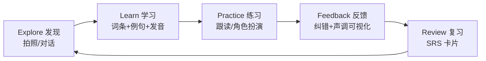
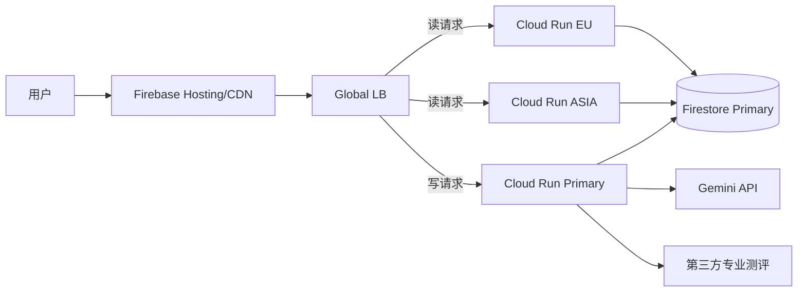
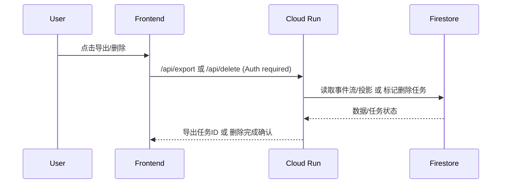
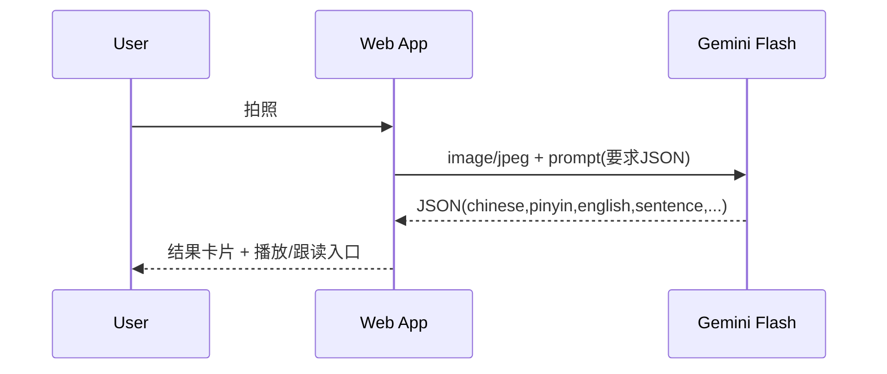
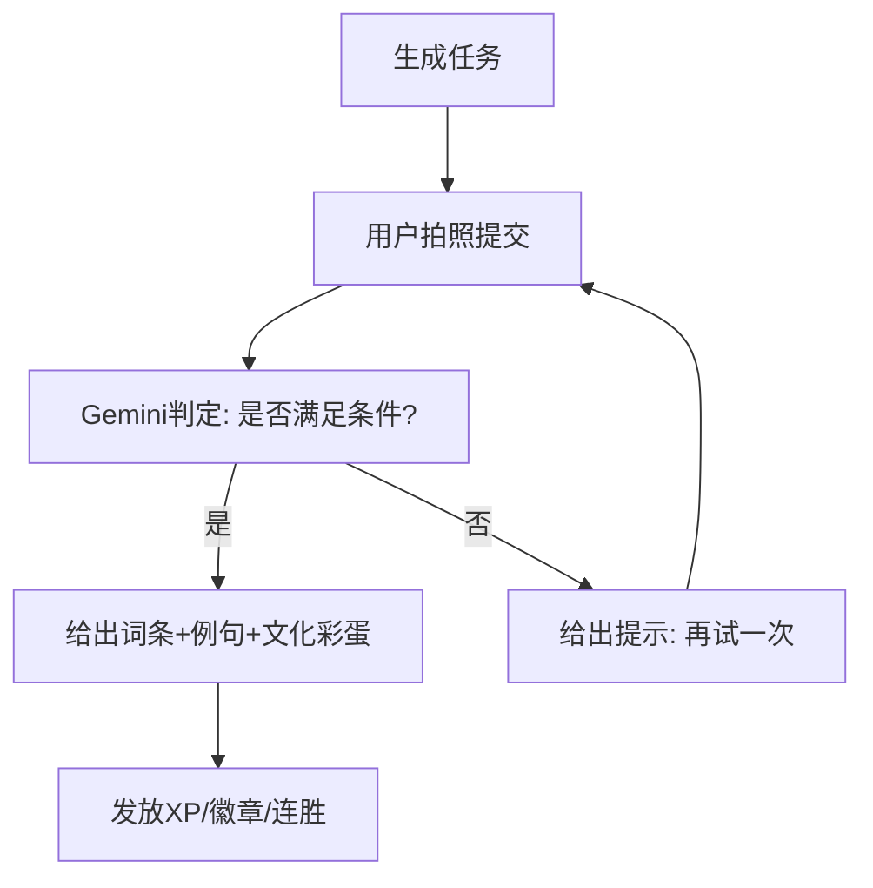
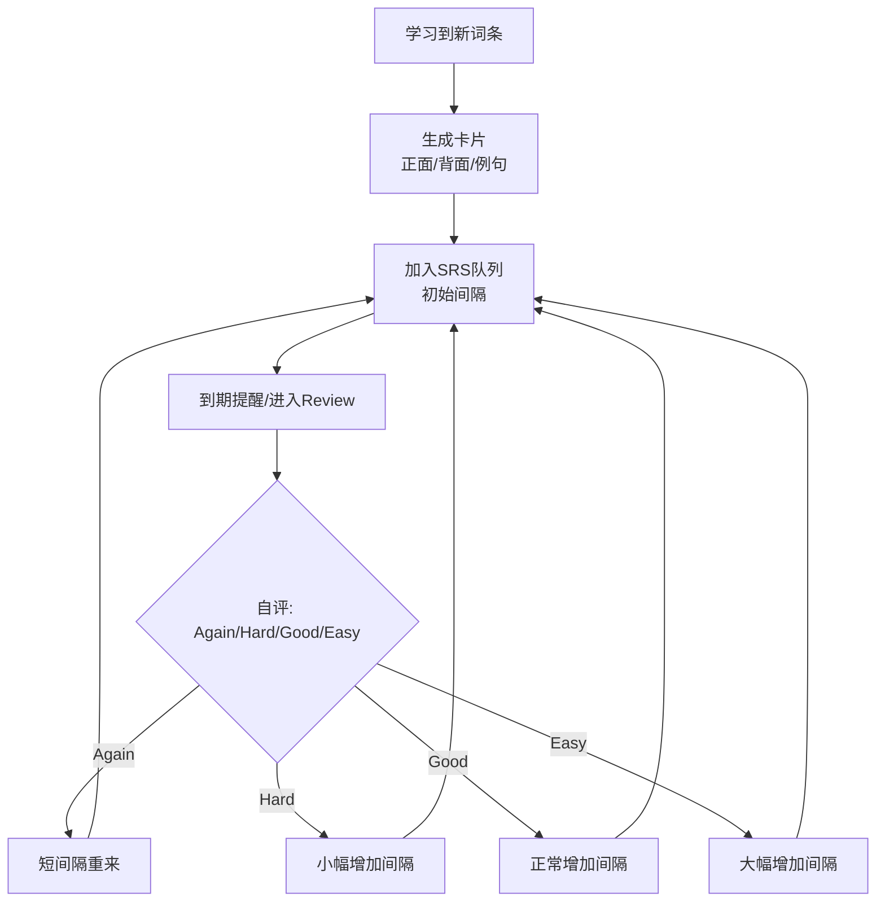

# Codex 中文学习（LinguaLens）技术方案 v1

> 目标：基于当前 `中文学习/` 文件夹内的代码与文档，整理需求并给出一份更“有趣、轻松、适合外国人”的中文学习技术方案。  
> 方案强调：表格化需求、清晰流程图、可落地的交互原型（ASCII）。

参考输入：`中文学习/README.md`、`中文学习/gemini中文学习.md`、`中文学习/claude中文学习.md`、`中文学习/index.tsx`、`中文学习/index.html`、`中文学习/metadata.json`、`中文学习/vite.config.ts`、`中文学习/package.json`。

---

## 0. 现状盘点（来自当前仓库实现）

| 项目 | 现状 |
|---|---|
| 应用形态 | 前端单页（React + Vite），直接在浏览器调用 Gemini |
| 模式 | `Snap & Learn`（拍照静态分析）+ `Live Tutor`（视频+音频实时对话） |
| Snap 输出 | JSON：`chinese/pinyin/english/sentence/sentencePinyin/sentenceEnglish`（`index.tsx` 里有 `responseSchema`） |
| Live 输出 | 实时音频（模型返回 PCM16 base64），前端播放；前端每秒发 1 帧图像 + 连续发麦克风 PCM16 |
| 权限 | `metadata.json` 申请 `camera/microphone` |
| API Key | 通过 Vite `define` 注入到前端（`vite.config.ts`），存在“Key 暴露”风险（见开放问题） |

---

## 1. 产品目标与受众（让外国人学得更轻松）

| 维度 | 设定 |
|---|---|
| 目标用户（Personas） | 初级-中级中文学习者（HSK 1–4 为主）：留学生/外企员工/游客/在华生活的 expat |
| 核心动机 | “看得懂、敢开口、用得上”，而不是“背单词” |
| 学习场景 | 真实世界（看到物品就学）+ 情景对话（点餐/打车/买东西/开会寒暄） |
| 成功指标（建议） | 7 日留存、每日开口次数、任务完成数、复习正确率、声调准确率提升曲线 |

---

## 2. 需求总表（现有 + 优化）

> 以“更有趣”为主线：任务化（Quest）+ 反馈可视化（Feedback）+ 复习闭环（Review）。

| 模块 | 用户价值 | 关键输入 | 关键输出 | 现状 | 优先级 |
|---|---|---|---|---|---|
| Snap 识物学词 | 看到就学，低门槛 | 图片 | 词条（中/拼/英）+例句 | 已有 | P0 |
| Live 实时私教 | 敢开口，纠音 | 音频+视频帧 | 实时语音回复 | 已有 | P0 |
| Quest 寻宝（Scavenger Hunt） | 把“学习”变“游戏” | 任务+照片 | 判定结果+奖励 | 待做 | P0 |
| Roleplay 角色扮演 | 情景对话更实用 | 选场景+语音 | 对话推进+纠错 | 待做（现有 Live 可承载） | P0 |
| 声调可视化（Tone Visualizer） | 让“声调”可见可练 | 用户音频 | 音高曲线+评分 | 待做 | P1 |
| 复习系统（SRS） | 把学过的记住 | 学习记录 | 卡片复习+间隔算法 | 待做 | P1 |
| 文化彩蛋（Fun Fact / Meme Reward） | 让内容更有趣 | 词条/场景 | 文化点/表情包/梗 | 待做 | P2 |

---

## 3. 学习闭环（核心流程图）



---

## 4. 交互与信息架构（IA）

```text
Home
 ├─ Snap & Learn
 │   └─ Result Card (Word + Sentence + Try Speaking)
 ├─ Quest Hunt (NEW)
 │   ├─ Mission Brief
 │   └─ Submit Photo -> Judge -> Reward
 ├─ Roleplay (NEW, 基于 Live)
 │   ├─ Scenario Select
 │   └─ Live Conversation + Coach Tips
 └─ Review (NEW)
     └─ Flashcards (SRS)
```

---

## 5. 原型（ASCII）——让外国人一眼看懂怎么玩

### 5.1 首页（任务驱动 + 轻松语气）

```text
+--------------------------------------------------+
| LinguaLens   [HSK: 2]            🔥 Streak: 3 days|
+--------------------------------------------------+
| Today's Quest                                    |
|  "Find something 圆的 (round) AND 红色的 (red)"   |
|  Reward: +50 XP  +1 Badge                         |
|  [ Start Hunt ]                                   |
+--------------------------------------------------+
| Learn Quickly                                    |
|  [ 📷 Snap & Learn ]   [ 🎭 Roleplay ]   [ 🧠 Review ] |
+--------------------------------------------------+
| Tip: Tap any Chinese word to see radicals & story |
+--------------------------------------------------+
```

### 5.2 Quest Hunt（任务 -> 验证 -> 奖励）

```text
+--------------------------------------------------+
| < Back                 QUEST: 红色 + 圆的         |
+--------------------------------------------------+
| Mission brief                                    |
|  1) Find it in real life                          |
|  2) Take a photo                                  |
|  3) Say the word aloud (optional bonus)           |
|                                                  |
| [ Camera View ]                                   |
|                                                  |
|  [ Capture ]                                      |
+--------------------------------------------------+
| After capture:                                    |
|  Judge: ✅ Yes, it's "苹果" (píng guǒ)             |
|  Bonus: Tone 72%  (+10 XP)                        |
|  Fun fact: "苹果" also appears in ...             |
+--------------------------------------------------+
```

### 5.3 Roleplay（对话面板 + 纠错提示）

```text
+--------------------------------------------------+
| Roleplay: Order Coffee (点咖啡)                   |
+--------------------------------------------------+
| AI (Barista): 你好！你想喝什么？                   |
| You: (hold to talk)                               |
|                                                  |
| Coach panel                                       |
|  Key phrase: "我要一杯拿铁"                        |
|  Pinyin: wǒ yào yì bēi ná tiě                     |
|  Tone meter:  [====.....] 57%                     |
+--------------------------------------------------+
| [ Hold to Talk ]   [ Hint ]   [ Slow down ]       |
+--------------------------------------------------+
```

### 5.4 Review（SRS 卡片复习）

```text
+--------------------------------------------------+
| Review (今天要复习 12 张)                         |
+--------------------------------------------------+
| Card 3 / 12                                      |
|                                                  |
|   汉字:  杯子                                     |
|   Pinyin: bēi zi                                  |
|   English: cup                                    |
|                                                  |
|  Prompt: "我需要一个____。"                        |
|                                                  |
| [ Show Answer ]                                   |
+--------------------------------------------------+
|  Self-grade:  [ Again ] [ Hard ] [ Good ] [ Easy ]|
+--------------------------------------------------+
```

### 5.5 双语呈现规则（已定：中英双语，更生活）

| 区域 | 默认显示 | 交互 |
|---|---|---|
| AI 对话气泡 | `ZH` + 小号 `EN` | 点击 `ZH` 展示拼音/慢速播放 |
| 教练面板（Key phrase） | `ZH + Pinyin + EN` | 一键复制中文；一键跟读 |
| 纠错提示 | 优先英文解释 + 对应中文例子 | 支持“给我更简单说法”按钮 |
| 场景目标 | 英文为主 + 中文关键词 | 降低初学者进入门槛 |

---

## 6. 技术架构（当前可行 + 生产可行）

### 6.1 组件图（建议版）

```mermaid
flowchart TB
  subgraph Browser[前端 Web (React + Vite)]
    UI[UI/UX<br/>Snap/Quest/Roleplay/Review]
    Media[Camera/Mic/WebAudio]
    Local[LocalStorage/IndexedDB<br/>progress, SRS]
  end

  subgraph Backend[可选后端（生产建议）]
    Proxy[API Proxy<br/>Key保护/限流/审计]
    UserDB[(User + Progress)]
  end

  subgraph Gemini[Gemini API]
    Flash[generateContent<br/>图片->结构化JSON]
    Live[live.connect<br/>音频对话 + 图像上下文]
  end

  UI --> Media
  UI --> Local
  Media --> Flash
  Media --> Live
  UI -.生产.-> Proxy --> Flash
  UI -.生产.-> Proxy --> Live
  Proxy --> UserDB
```

### 6.2 Key 管理方案对比（必须讨论）

| 方案 | 描述 | 优点 | 缺点 | 建议 |
|---|---|---|---|---|
| 纯前端直连 | 目前做法：Key 注入前端 | 最简单、开发快 | Key 暴露、难限流、难审计 | 仅 Demo / 内部试用 |
| 后端代理 | 前端不持有 Key，后端转发 | Key 安全、可限流、可做内容审核/日志 | 增加部署与成本 | 面向真实用户推荐 |

### 6.2.1 最终落地选型（已定：GCP + Cloud Run 多区域）

| 需求 | 选型 | 关键点 |
|---|---|---|
| 前端托管 | Firebase Hosting（先用默认域名，后续绑定自定义域名） | 方便做 OAuth 回调；全球 CDN |
| 后端代理 | Cloud Run（多区域部署）+ 全局负载均衡 | 后端持有密钥，前端不暴露 |
| 数据存储 | Firestore（单主写入：所有写入打到主区域） | 多区域服务只做就近读；写请求统一到主区域 |
| 密钥 | Secret Manager | Gemini Key + 第三方测评 Key |
| 认证 | Firebase Auth / Identity Platform | Google + Apple；游客=匿名账号但不云同步 |
| 事件保留 | TTL（`expiresAt`） | 事件与模型输出默认保留 1 个月 |
| 限流/配额 | 后端强制配额 +（可选）Cloud Armor | 游客/用户：每日 5 次 Roleplay、每次 ≤10 分钟 |

### 6.2.2 单主写入 + 多区域读（路由方式）



### 6.3 性能预算与优化点（来自当前实现细节）

| 维度 | 当前实现 | 目的 | 可调参数（建议） |
|---|---|---|---|
| Live 视频上下文 | 1 FPS 采样发送 | 降带宽、保留语境 | `fps=0.5~2`（按网络自适应） |
| Live 图像大小 | Canvas 缩放到 50% | 降 CPU/带宽 | `scale=0.35~0.75` |
| Live JPEG 质量 | `0.6` 压缩 | 降体积 | `jpegQuality=0.5~0.8` |
| Snap JPEG 质量 | `0.8` | 更清晰识别 | 低端机可降到 `0.6~0.75` |
| 音频上行 | `audio/pcm;rate=16000` | 兼顾质量与体积 | 视模型要求固定或做降噪 |
| 音频下行 | 24kHz PCM16，前端调度播放 | 保持连续不爆音 | 需要更稳可改 AudioWorklet |

### 6.4 错误处理矩阵（建议作为 UI 文案与恢复策略基线）

| 错误类型 | 检测点 | 用户提示（更友好） | 恢复策略 |
|---|---|---|---|
| 摄像头/麦克风权限拒绝 | `getUserMedia` catch | `需要相机/麦克风权限才能开始练习` | 引导打开浏览器权限页 + “再试一次” |
| Live 连接失败 | `onerror` / 超时 | `连接有点慢，我们再连一次` | 指数退避重连 + 降级到 Snap |
| Snap JSON 解析失败 | `JSON.parse` 异常 | `我没看清，再拍一张试试？` | 自动重试一次 + 展示原始文本（调试开关） |
| 音频播放异常 | `AudioContext` 异常 | `音频播放失败，先看文字提示` | 降级显示文字反馈 |

### 6.5 GCP 最省钱落地建议（默认方案，按已定选型校准）

| 需求 | 默认选型 | 说明 |
|---|---|---|
| 前端托管 | Firebase Hosting | 先用默认域名；后续再绑定自定义域名 |
| 后端代理（含 Live） | Cloud Run 多区域 | 统一转发 Gemini + 第三方测评；写请求路由到主区域 |
| 全局入口 | Global LB | 读就近、写到主区域（单主写入） |
| 鉴权 | Firebase Auth（Google/Apple/Anonymous） | 游客可用但不云同步 |
| 事件溯源存储 | Firestore（主区域） | append-only 事件流 + 投影表；TTL=1个月 |
| 密钥管理 | Secret Manager | 所有密钥只在后端使用 |
| 配额/限流 | 后端配额（必选） | 每日 5 次 Roleplay、每次≤10分钟 |
| 监控告警 | Cloud Monitoring | 成本、延迟、错误率、配额命中率 |

### 6.6 权限与配额（游客 vs 登录）

| 能力 | 游客（Anonymous） | 登录用户（Google/Apple） |
|---|---:|---:|
| Roleplay | ✅（每日 5 次，≤10 分钟/次） | ✅（默认同配额，可后续升级） |
| 云端同步 | ❌ | ✅ |
| 历史记录（事件溯源） | 本地临时（可选） | ✅（保留 1 个月） |
| 复习/进度统计 | 受限（不跨设备） | ✅（跨设备） |

### 6.7 后端 API（建议：最小集合）

| Endpoint | Method | Auth | 作用 |
|---|---|---|---|
| `/api/quota` | `GET` | optional | 返回当日剩余次数、当前会话剩余时长 |
| `/api/roleplay/start` | `POST` | optional | 开始 Roleplay（返回 `sessionId`、首轮 `assistantText`） |
| `/api/roleplay/turn` | `POST` | optional | 发送用户文本/音频引用（或由前端走 Live），返回结构化纠错与下一步提示 |
| `/api/roleplay/end` | `POST` | optional | 结束会话，返回 `sessionSummary`、可复习词条列表 |
| `/api/export` | `POST` | required | 导出用户事件与投影（异步任务） |
| `/api/delete` | `POST` | required | 注销账号并触发数据删除（立即失效 + 后台清理） |

> 注：当前前端实现是“前端直连 Live API”。生产版推荐把 Live 连接也经由后端签发短期凭据/会话（避免 Key 暴露），但具体传输形态会受 Gemini Live SDK/协议约束影响，可在实现阶段定稿。

### 6.8 事件溯源（Event Sourcing）数据模型（已定：只存事件 + 模型输出，不存原始媒体）

**事件流（append-only）**

| 字段 | 类型 | 说明 |
|---|---|---|
| `eventId` | string | 全局唯一（ULID/UUID） |
| `userId` | string | 游客也分配匿名 `userId`（但不云同步） |
| `ts` | timestamp | 事件发生时间 |
| `type` | string | 事件类型（见下表） |
| `payload` | object | 事件负载（只含文本/结构化输出/评分） |
| `expiresAt` | timestamp | TTL=1个月，自动清理 |

**投影（projection / read model）**

| 投影 | 用途 | 更新方式 |
|---|---|---|
| `user_profile` | 基本信息/语言偏好 | 由登录/设置事件驱动 |
| `usage_daily` | 当日次数/时长配额消耗 | 由 `roleplay_*` 事件增量更新 |
| `roleplay_history` | 会话列表、摘要、可复习词条 | 会话结束时生成 |
| `vocab_progress` | 词条掌握度/SRS 队列 | 由学习/复习事件驱动 |

**核心事件类型（建议）**

| type | 何时产生 | payload 关键字段（示例） |
|---|---|---|
| `roleplay_started` | 开始会话 | `sessionId, scenarioId, locale` |
| `roleplay_turn_user` | 用户一轮输入 | `sessionId, inputMode(text/voice), transcriptZh?, transcriptEn?` |
| `roleplay_turn_ai` | AI 一轮输出 | `sessionId, assistantText{zh,en}, keyPhrases[], corrections[]` |
| `pronunciation_scored` | 专业测评返回 | `sessionId, overallScore, toneScore, errorSpans[]` |
| `roleplay_ended` | 结束会话 | `sessionId, sessionSummary{zh,en}, learnedItems[]` |

### 6.9 数据导出/删除（用户自助）



### 6.10 最小安全与防滥用（已定：不做内容审核）

| 类别 | 默认策略 | 目的 |
|---|---|---|
| Key 保护 | Key 只在 Cloud Run + Secret Manager | 防止前端泄露 |
| 鉴权 | Firebase Auth；游客=匿名 | 区分游客/登录配额 |
| 配额 | 每日 5 次 Roleplay、每次 ≤10 分钟 | 成本上限 |
| 速率限制 | IP + userId 维度（后端实现，必要时加 Cloud Armor） | 防刷与 DDoS 风险下降 |
| 审计 | 记录请求元数据与配额命中（不记录原始媒体） | 可追踪、可控成本 |
| 告警 | 错误率、延迟、成本、调用量异常告警 | 及时止损 |

---

## 7. 关键流程（面向实现的“合同式”流程图）

### 7.1 Snap & Learn（静态识物）



### 7.2 Live Tutor（实时对话 + 图像上下文）

```mermaid
sequenceDiagram
  participant U as User
  participant W as Web App
  participant L as Gemini Live
  U->>W: 开始会话(授权摄像头/麦克风)
  W->>L: connect(systemInstruction, audio response)
  loop 音频上行
    W->>L: audio/pcm;rate=16000 (base64)
  end
  loop 视频上下文(1FPS)
    W->>L: image/jpeg (base64)
  end
  L-->>W: audio chunks (pcm16 base64)
  W-->>U: 播放AI语音 + Coach UI
```

### 7.3 Quest Hunt（新增：判定与奖励）



---

## 8. 输出规范（让前端“稳定渲染”，减少模型跑偏）

### 8.1 Snap JSON Schema（现有字段 + 建议扩展）

| 字段 | 类型 | 必填 | 示例 | 用途 |
|---|---|---:|---|---|
| `chinese` | string | 是 | `杯子` | 主词条 |
| `pinyin` | string | 是 | `bēi zi` | 发音 |
| `english` | string | 是 | `cup` | 翻译 |
| `sentence` | string | 是 | `我需要一个杯子。` | 例句 |
| `sentencePinyin` | string | 是 | `wǒ xū yào yí gè bēi zi` | 跟读 |
| `sentenceEnglish` | string | 是 | `I need a cup.` | 理解 |
| `hskLevel` | number | 否 | `2` | 难度分级 |
| `radicals` | string[] | 否 | `["木","子"]` | 汉字拆解 |
| `funFact` | string | 否 | `“干杯” means cheers.` | 趣味文化 |
| `commonMistake` | string | 否 | `不要把 bēi 读成 bèi` | 纠错提示 |

### 8.2 Quest 判定输出（建议）

| 字段 | 类型 | 必填 | 示例 |
|---|---|---:|---|
| `pass` | boolean | 是 | `true` |
| `reason` | string | 是 | `It looks round and red.` |
| `targetWord` | object | 是 | 同 Snap 输出子集 |
| `reward` | object | 是 | `{ "xp": 50, "badge": "Red Master" }` |

### 8.3 Roleplay 结构化输出（建议：用于事件溯源与 UI 纠错面板）

| 字段 | 类型 | 必填 | 示例 | 用途 |
|---|---|---:|---|---|
| `scenarioId` | string | 是 | `order_coffee` | 场景标识 |
| `turnId` | string | 是 | `t_0007` | 回合序号 |
| `assistantText` | object | 是 | `{ "zh":"你好！你想喝什么？", "en":"Hi! What would you like?" }` | 中英双语输出 |
| `keyPhrases` | array | 否 | `[{ "zh":"我要一杯拿铁", "pinyin":"wǒ yào yì bēi ná tiě", "en":"I'd like a latte." }]` | 教练面板 |
| `corrections` | array | 否 | `[{ "type":"tone", "zh":"拿铁", "en":"2nd tone rises more", "severity":"medium" }]` | 纠错与提示 |
| `nextPrompt` | object | 否 | `{ "zh":"你要热的还是冰的？", "en":"Hot or iced?" }` | 对话推进 |
| `sessionSummary` | object | 否 | `{ "zh":"你完成了点单。", "en":"You finished ordering." }` | 结算/复习入口 |

---

## 9. 声调可视化（P1，但对“敢开口”很关键）

### 9.1 设计要点表

| 项 | 方案 |
|---|---|
| 目标 | 让学习者看到自己声调曲线，并获得即时反馈 |
| 输入 | 麦克风音频（WebAudio） |
| 输出 | 音高曲线（pitch over time）+ 0–100 分 + 建议（例如“二声上扬不够”） |
| 技术路线 | 浏览器端 Pitch detection（可从简单实现开始） |
| 现实限制 | 噪声、设备差异、语速与连读都会影响准确度（需“容错评分”） |

### 9.2 评分策略（建议先易后难）

| 阶段 | 方法 | 好处 |
|---|---|---|
| v1 | “是否上扬/下滑/平稳”的粗分类 + 置信区间 | 容错高、可快速上线 |
| v2 | DTW（动态时间规整）对齐标准曲线 | 更接近专业评测 |
| v3 | 接入专业口语测评服务/自建模型 | 最准，但成本最高 |

### 9.3 已定：直接接入第三方“专业测评”（不自研）

| 项 | 决策 |
|---|---|
| 接入方式 | 后端（Cloud Run）调用第三方测评 API，返回结构化评分与错误点 |
| 数据边界 | 仅上传测评所需的短音频片段；不在自家云端存原始音频（只存评分与错误点，保留 1 个月） |
| 输出要求 | 至少包含：总分、声调相关分、可解释错误点（词/音节/声调维度） |
| 失败降级 | 测评不可用时：仍完成 Roleplay，对纠错面板标注“暂不可用”并不计入评分成就 |

---

## 10. 里程碑（MVP 到增强版）

| 版本 | 范围 | 交付物 |
|---|---|---|
| MVP（1–2 周） | Snap + Live 稳定性、UI 更“轻松” | 统一卡片、错误处理、基础任务化入口 |
| V1（2–4 周） | Quest Hunt + Roleplay 场景包 | 任务生成/判定协议、场景脚本、奖励体系 |
| V2（4–8 周） | Review（SRS）+ 声调可视化 | 学习记录、复习队列、可视化反馈 |

### 10.1 Roleplay 场景包（建议先做 8 个）

| 场景 | 学习目标 | 关键词（示例） | 难度 |
|---|---|---|---|
| 点咖啡 | 礼貌点单 | 我要/一杯/少糖 | 入门 |
| 打车 | 目的地表达 | 去/到/多少钱 | 入门 |
| 餐厅点菜 | 口味偏好 | 不要/辣/推荐 | 入门 |
| 超市结账 | 数字与量词 | 这个/多少钱/一共 | 入门 |
| 约时间 | 时间表达 | 明天/下午/可以吗 | 初级 |
| 看病挂号 | 身体部位 | 哪里不舒服/疼 | 初级 |
| 同事寒暄 | 社交小聊 | 最近/怎么样/周末 | 初级 |
| 小会议开场 | 商务常用句 | 先/介绍一下/然后 | 初级 |

#### 10.1.1 场景输出要求（已定：更生活 + 中英双语）

| 要求 | 说明 |
|---|---|
| 生活化 | 优先日常口语（减少“商务腔”），必要时再提供商务同义表达 |
| 双语 | 每轮 `assistantText` / `nextPrompt` 都给 `zh/en`；关键短语给 `zh/pinyin/en` |
| 可复习 | 每个场景会话结束生成 `sessionSummary` 与“复习卡片候选”列表 |

### 10.2 Review（SRS）流程图（建议）



---

## 11. 需要讨论/待确认的问题（请你拍板）

### 11.1 已确认决策（你已拍板）

| 话题 | 结论 |
|---|---|
| 后端代理与云 | Google Cloud：`Cloud Run` + 多区域部署（以“简单、省钱”为第一原则） |
| API Key 安全 | 上后端代理保护 `GEMINI_API_KEY`（前端不再持有 Key） |
| MVP 优先级 | 先做 `Roleplay`（情景对话），并一次性覆盖 8 个生活化场景包 |
| 登录策略 | Google & Apple OAuth；允许游客体验（可 Roleplay），但限制功能与云同步（游客不云同步） |
| 游客限制 | 每天最多 `5` 次 Roleplay；每次 `<=10` 分钟（后端强制） |
| 数据策略 | 云端存：全部学习事件 + 模型输出；不存原始照片/音频/视频帧；事件溯源（Event Sourcing） |
| 数据保留 | 默认保留 `1` 个月（超期自动清理） |
| Quest 判定 | 仅用 Gemini 视觉判定（不引入额外 CV 服务） |
| 测评策略 | Quest 判定/奖励/声调：直接上“专业测评/专业服务”（允许第三方供应商） |
| 账号与合规 | 提供“数据导出/账号注销与删除”（用户自助） |
| 域名与回调 | Apple Developer 已具备；自定义域名后续再申请（先用托管域名做 OAuth 回调） |
| UI 语言 | 中英双语（UI 文案双语 + 关键知识点双语） |
| 内容安全 | 不启用内容审核/封禁（但保留配额/限流/审计与异常告警，防止成本失控） |

### 11.2 剩余可选项（不阻塞开发：给出默认值）

| 话题 | 默认值（我会按此落地） | 你未来可能想改的点 |
|---|---|---|
| 难度分级 | 按 HSK 1–4 先做；不做入门定级测试 | 增加定级/自适应难度 |
| 计费与风控 | V1 不做付费；仅用配额控制成本 | 后续订阅、额度升级、团队版 |
| 域名迁移 | 先用 Firebase 托管域名跑通 OAuth；拿到自定义域名后再迁移 | 统一品牌域名、SEO、Cookie 策略 |
| 配额升级 | 默认游客=登录用户同配额（5 次/天）；后续付费提升 | 按订阅层级提升次数/时长 |

---

## 12. 附：与现有实现的对齐建议（小改动就能更“有趣”）

| 位置 | 当前 | 建议改造方向 |
|---|---|---|
| Snap 提示词 | “business-appropriate”偏严肃 | 增加 `funFact`、`commonMistake` 字段，语气更轻松 |
| Live systemInstruction | 商务私教风格 | 增加 Roleplay 模板（店员/出租车/同事）与“纠错短句”格式 |
| UI 色调 | 深色商务感强 | 引入“任务卡 + 徽章 + 连胜”视觉元素（不一定要卡通，但要更游戏化） |

---

## 13. 下一步（建议你确认后我再继续落地）

| Step | 产出 | 验收标准 |
|---|---|---|
| 1 | 后端代理最小实现（含 Live 流式） | 前端不含 Key；可限流/审计；Live 会话可正常对话 |
| 2 | 登录 + 云端同步骨架 | 用户可跨设备同步：学习记录/复习队列/成就进度 |
| 3 | Roleplay MVP（8 场景跑通） | 8 场景均可进入；每次会话 ≤10 分钟；事件与模型输出可回放 |
| 4 | 接入专业测评（发音/声调） | 能返回可解释的评分（含错误点），并能驱动 UI 提示 |
| 5 | 合规与“最小安全”方案 | 明确留存策略（1个月）、权限弹窗文案、导出/删除、自带配额与告警（不启用内容审核） |
| 6 | 域名迁移计划（后续） | 自定义域名申请后：更新 OAuth 回调、Cookie 策略、全局入口域名与 CORS |
