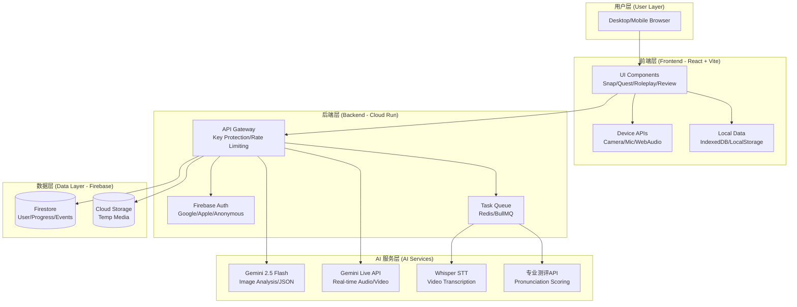
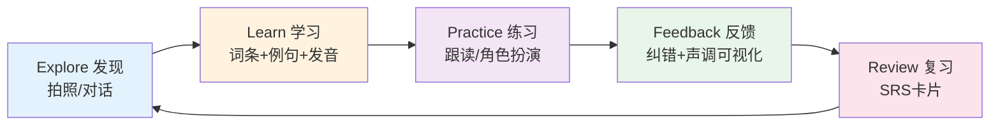

# LinguaLens 中文学习网页技术文档
## 智能化、游戏化的沉浸式中文学习平台 (Comprehensive Technical Specification)

> **项目愿景**: 让全球学习者通过 AI 视觉识别与实时语音交互，在真实场景中轻松、有趣、高效地掌握中文。

---

## 目录

1. [产品定位与核心价值](#1-产品定位与核心价值)
2. [系统架构与技术栈](#2-系统架构与技术栈)
3. [核心功能模块](#3-核心功能模块)
4. [用户体验设计](#4-用户体验设计)
5. [商业模式与变现策略](#5-商业模式与变现策略)
6. [技术实现细节](#6-技术实现细节)
7. [数据与隐私架构](#7-数据与隐私架构)
8. [开发路线图](#8-开发路线图)
9. [讨论与优化建议](#9-讨论与优化建议)

---

## 1. 产品定位与核心价值

### 1.1 产品定位

| 维度 | 描述 |
|------|------|
| **产品名称** | LinguaLens (语言透镜) |
| **核心理念** | "所见即所学, 敢说就会" - 将真实世界变成中文课堂 |
| **目标市场** | 全球中文学习者（重点：商务人士、旅行者、在华expat） |
| **核心技术** | Gemini 2.5 Multi-modal AI + Real-time Audio/Video |
| **平台形态** | Desktop-First Responsive Web App (PWA) |

### 1.2 目标用户画像（优先级）

```
                              ┌─────────┐
                              │  P0     │
                              │ 商务精英 │  ← 核心：来华商务人士/外企高管
                            ┌─┴─────────┴─┐
                            │    P0       │
                            │  高端旅行   │  ← 核心：自由行、文化体验游客
                          ┌─┴─────────────┴─┐
                          │      P1         │
                          │   外派驻华      │  ← 次要：长期驻华工作人员
                        ┌─┴─────────────────┴─┐
                        │        P2           │
                        │   海外学习者        │  ← 拓展：大学生/语言爱好者
                        └─────────────────────┘
```

| 用户类型 | 典型场景 | 核心痛点 | 付费意愿 | 使用频率 |
|---------|---------|---------|---------|------------|
| **商务出差** 👔 | 会议、商务宴请、谈判 | 无法与本地客户/同事沟通，商务礼仪不熟 | ⭐⭐⭐⭐⭐ 极高 | 出差前/中集中 |
| **高端旅行** ✈️ | 自由行、美食、文化 | 点餐/问路/购物困难，错过深度体  验 | ⭐⭐⭐⭐ 高 | 旅行期高频 |
| **外派驻华** 🏢 | 日常生活、职场社交 | 长期沟通障碍影响工作生活质量 | ⭐⭐⭐⭐⭐ 极高 | 长期稳定 |
| **海外学习** 🎓 | 课外练习、HSK备考 | 缺乏真实语境与实时反馈 | ⭐⭐⭐ 中 | 日常学习 |

### 1.3 核心价值主张

| 传统学习方式 | LinguaLens 解决方案 |
|-------------|-------------------|
| 死记硬背单词卡 | 📸 **拍照即学** - 实物关联记忆，自然场景学习 |
| 发音无反馈 | 🎤 **AI实时纠音** - 声调可视化，专业评测 |
| 缺乏语境 | 💬 **智能生成语境** - 商务/旅游情景对话 |
| 学习枯燥无趣 | 🎮 **游戏化激励** - 任务、徽章、连胜、排行 |
| 进度不可见 | 📊 **数据可视化** - 学习轨迹、掌握度曲线 |

---

## 2. 系统架构与技术栈

### 2.1 整体架构设计



### 2.2 核心技术栈对比

| 层级 | 技术选型 | 版本 | 选择理由 |
|------|---------|------|---------|
| **前端框架** | React | 19.x | 成熟生态，组件复用，hooks优势 |
| **构建工具** | Vite | 6.x | 极速开发体验，HMR，ESM优先 |
| **类型安全** | TypeScript | 5.x | 减少运行时错误，提升可维护性 |
| **样式方案** | Tailwind CSS | 3.x | 原子化CSS，快速开发，小体积 |
| **状态管理** | React Context + Hooks | - | 轻量级，避免Redux复杂度 |
| **AI SDK** | @google/genai | latest | 官方SDK，完整类型支持 |
| **音频处理** | Web Audio API | - | 浏览器原生，无需依赖 |
| **后端服务** | Cloud Run (Node.js) | - | Serverless，按需扩容，成本优化 |
| **认证** | Firebase Auth | - | OAuth集成，匿名账号支持 |
| **数据库** | Firestore | - | 实时同步，多区域就近读 |
| **文件存储** | Cloud Storage | - | 临时媒体存储（异步处理） |
| **支付** | Stripe | - | 国际支付首选，订阅管理成熟 |

### 2.3 部署架构（全球低延迟方案）

| 组件 | 部署方式 | 区域策略 |
|------|---------|---------|
| **前端托管** | Firebase Hosting | 全球CDN（自动就近） |
| **API Gateway** | Cloud Run + Global LB | 多区域部署（HK/EU/US） |
| **主数据库** | Firestore（单主写入） | 主区域: HK（asia-east2） |
| **读副本** | Firestore多区域读 | 就近读取，降低延迟 |
| **Whisper队列** | Cloud Tasks | 主区域处理（异步） |

---

## 3. 核心功能模块

### 3.1 功能模块全景图

| 模块 | 用户价值 | 输入 | 输出 | 优先级 | 状态 |
|------|---------|------|------|-------|------|
| **Snap & Learn** | 看到就学，低门槛 | 照片 | 词条+例句+文化点 | P0 | ✅ 已实现 |
| **Quest Hunt** | 学习游戏化 | 任务+照片 | 判定+奖励+XP | P0 | 🔄 优化中 |
| **Roleplay** | 情景对话实战 | 场景+语音 | 对话+纠错 | P0 | 🔄 MVP阶段 |
| **Tone Visualizer** | 声调可见可练 | 用户音频 | 音高曲线+评分 | P1 | 📋 待接入测评 |
| **Multi-Source Learn** | 个性化素材 | YouTube/PDF | 生词卡+练习 | P1 | 🔄 Whisper集成中 |
| **SRS Review** | 间隔复习系统 | 学习记录 | 复习卡片 | P1 | 📋 待开发 |
| **Cultural Decoder** | 文化梗解析 | 链接/截图 | 文化背景 | P2 | 💡 规划中 |

### 3.2 学习闭环流程



### 3.3 Snap & Learn（静态识物学习）

**核心流程**
```
用户拍照 → Gemini Flash分析 → 返回结构化JSON → 展示学习卡片 → 语音播放/跟读
```

**JSON Schema**
```typescript
interface SnapAnalysis {
  chinese: string;         // "苹果"
  pinyin: string;          // "píng guǒ"
  english: string;         // "apple"
  sentence: string;        // "这个苹果很甜。"
  sentencePinyin: string;  // "zhè ge píng guǒ hěn tián"
  sentenceEnglish: string; // "This apple is very sweet."
  hskLevel?: number;       // 2 (难度分级)
  funFact?: string;        // "苹果在中国也象征平安"
  commonMistake?: string;  // "不要把 píng 读成 pín"
  radicals?: string[];     // ["艹", "平", "果"]
}
```

### 3.4 Quest Hunt（任务寻宝游戏）

**设计理念**: 将学习变成探索游戏，增加趣味性与成就感

**任务示例**
| 任务类型 | 描述 | 奖励 |
|---------|------|------|
| 颜色+形状 | 找到"红色"且"圆的"物体 | +50 XP, Badge: Red Master |
| 场景任务 | 在咖啡店拍下"菜单" | +30 XP, 解锁"点餐"场景 |
| 文化探索 | 找带"龙"元素的物品 | +100 XP, 文化徽章 |

**原型界面**
```text
+--------------------------------------------------+
| LinguaLens   [HSK 2]            🔥 Streak: 3 days|
+--------------------------------------------------+
| Today's Quest                                    |
|  "Find something 圆的 (round) AND 红色的 (red)"   |
|  Reward: +50 XP  +1 Badge                         |
|  [ Start Hunt ]                                   |
+--------------------------------------------------+
| Learn Quickly                                    |
|  [ 📷 Snap ]   [ 🎭 Roleplay ]   [ 🧠 Review ]   |
+--------------------------------------------------+
```

### 3.5 Roleplay（情景对话模拟器）

**8大核心场景（按难度排序）**

| 场景 | 学习目标 | 关键词 | HSK等级 |
|------|---------|-------|---------|
| 点咖啡 | 礼貌点单 | 我要/一杯/少糖 | 1-2 |
| 打车 | 目的地表达 | 去/到/多少钱 | 1-2 |
| 餐厅点菜 | 口味偏好 | 不要/辣/推荐 | 2 |
| 超市结账 | 数字与量词 | 这个/一共/支付宝 | 2 |
| 约时间 | 时间表达 | 明天/下午/可以吗 | 2-3 |
| 看病挂号 | 身体部位 | 哪里/不舒服/疼 | 3 |
| 同事寒暄 | 社交小聊 | 最近/怎么样/周末 | 3 |
| 商务会议 | 职场常用句 | 先/介绍/然后 | 3-4 |

**AI Coach 介入逻辑**（双模式）

```
┌─────────────────────────────────────────────┐
│  Soft Coaching (默认 - Mode 2)               │
├─────────────────────────────────────────────┤
│  • AI保持角色不中断对话                      │
│  • 侧边栏实时显示纠错提示                    │
│  • 连续3次重复错误 → 语音温柔打断            │
│  • 优势: 沉浸感强，不破坏场景氛围            │
└─────────────────────────────────────────────┘
```

**Roleplay 界面原型**
```text
+--------------------------------------------------+
| Roleplay: Order Coffee (点咖啡)        [3/10 min]|
+--------------------------------------------------+
| AI (Barista): 你好！你想喝什么？                 |
|                                                  |
| Coach Panel (侧边栏)                             |
|  💡 Key phrase: "我要一杯拿铁"                   |
|  📝 Pinyin: wǒ yào yì bēi ná tiě                 |
|  🎯 Tone: [====.....] 57%  (二声略平)            |
+--------------------------------------------------+
| [ Hold to Talk ]   [ Hint ]   [ End Session ]    |
+--------------------------------------------------+
```

### 3.6 Cheat Mode（作弊模式/渐进式难度）

**设计理念**: 防止挫败感，允许降级到单音节练习

| 触发条件 | 系统行为 |
|---------|---------|
| 用户连续3次全句失败 | AI: "让我们先练习这个字好吗？" → 切换到单音节模式 |
| 单音节练习通过3次 | 自动升级回词组练习 |
| 词组通过5次 | 回到全句对话 |

### 3.7 Multi-Source Learning（全源学习）

**支持素材类型**

| 类型 | 处理流程 | 技术方案 |
|------|---------|---------|
| **YouTube视频** | URL → yt-dlp提取音频 → Whisper转录 → Gemini生成课件 | 异步队列，1-2分钟 |
| **PDF文档** | 上传 → 文本提取 → Gemini分析 → 生词卡 | 内存处理，不落盘 |
| **网页链接** | URL → Jina Reader抓取 → Gemini总结 → 练习生成 | 实时处理 |

**隐私保证**: 
- 原始文件仅存在于内存，分析完立即销毁
- 仅保存提取的词汇表与知识点（脱敏）
- 事件记录保留1个月后自动清理

---

## 4. 用户体验设计

### 4.1 信息架构

```text
Home
 ├─ Snap & Learn (快速学习)
 │   └─ Result Card (词条 + 例句 + 跟读)
 ├─ Quest Hunt (任务寻宝) ⭐ 新增
 │   ├─ Mission Brief (任务说明)
 │   └─ Submit & Judge (提交判定)
 ├─ Roleplay (情景对话) ⭐ 核心
 │   ├─ Scenario Select (场景选择)
 │   └─ Live Conversation (实时对话 + Coach面板)
 ├─ My Learning (学习中心)
 │   ├─ Vocabulary Book (词汇本 + SRS)
 │   ├─ Progress (统计图表)
 │   └─ Achievements (徽章/连胜)
 └─ Settings (设置)
     ├─ Profile (个人资料)
     ├─ Export Data (数据导出)
     └─ Delete Account (注销)
```

### 4.2 双语呈现策略

| 区域 | 显示规则 | 交互 |
|------|---------|------|
| AI对话气泡 | 中文 + 小号英文 | 点击展示拼音/慢速 |
| Coach面板 | 中文 + 拼音 + 英文 | 一键复制/跟读 |
| 任务描述 | 英文为主 + 中文关键词 | 降低门槛 |
| 纠错提示 | 英文解释 + 中文示例 | "更简单说法"按钮 |

### 4.3 游戏化机制

| 元素 | 设计 | 目的 |
|------|------|------|
| **XP系统** | 学习/复习/打卡均获得经验值 | 量化进步 |
| **连胜 (Streak)** | 连续天数打卡 | 培养习惯 |
| **徽章 (Badges)** | "红色大师"/"发音达人" | 成就感 |
| **关卡解锁** | 完成基础场景解锁高级场景 | 渐进式难度 |
| **排行榜** | 周/月学习时长排名（可选） | 社交激励 |

### 4.4 Tone Visualizer（声调可视化）

**核心设计**
```text
+--------------------------------------------------+
| Word: 咖啡 (kā fēi)                    [Try: 3/3]|
+--------------------------------------------------+
|  Target Tone Curve                               |
|     ─────   ╱─────     (Standard)                |
|                                                  |
|  Your Tone Curve                                 |
|     ───~─   ╱~~───     (72% match)               |
|                                                  |
|  💡 Tip: 第二个字 "fēi" 声调略低                 |
+--------------------------------------------------+
| [ Record Again ]   [ Next Word ]                 |
+--------------------------------------------------+
```

**技术方案阶段性路径**

| 阶段 | 方法 | 优缺点 |
|------|------|--------|
| **v1 (MVP)** | 基础分类（升/降/平） | 快速上线，容错高 |
| **v2 (优化)** | DTW动态时间规整 | 更精准对齐 |
| **v3 (生产)** | 第三方专业测评API | 最准确（已选定） |

---

## 5. 商业模式与变现策略

### 5.1 订阅计划设计

```
┌─────────────┐     ┌─────────────┐     ┌─────────────┐
│   FREE      │     │    PRO      │     │  PREMIUM    │
│   探索者     │     │   学习者    │     │   专业版   ⭐│
│             │     │             │     │             │
│    $0       │     │  $9.99/月   │     │ $19.99/月   │
│             │     │  $79/年     │     │ $159/年     │
└─────────────┘     └─────────────┘     └─────────────┘
```

| 功能特性 | FREE | PRO | PREMIUM | TEAM企业版 |
|---------|------|-----|---------|-----------|
| **价格** | $0 | $9.99/月 | $19.99/月 | 联系销售 |
| **年付优惠** | - | $79/年 (-34%) | $159/年 (-34%) | 定制 |
| | | | | |
| **Snap拍照学习** | 10次/天 | 100次/天 | ♾️ 无限 | ♾️ 无限 |
| **Roleplay对话** | 5次/天<br/>(≤10分钟/次) | 30分钟/天 | 120分钟/天 | ♾️ 无限 |
| **Multi-Source** | ❌ | 5个视频/月 | ♾️ 无限 | ♾️ 无限 |
| **词汇本容量** | 50词 | 500词 | ♾️ 无限 | ♾️ 无限 |
| **专业测评** | ❌ | 基础评分 | 详细反馈 | 详细+报告 |
| **SRS复习** | ❌ | ✅ | ✅ | ✅ |
| **多设备同步** | ❌ | ✅ | ✅ | ✅ |
| **客服支持** | 社区 | Email | 优先Email | 专属客服 |
| **定制场景** | ❌ | ❌ | ❌ | ✅ |

### 5.2 按需付费（点数制）

**设计理念**: 灵活消费，适合不定期使用的高端用户

| 充值档位 | 点数 | 赠送 | 单价 |
|---------|------|------|------|
| $10 | 100点 | - | $0.10/点 |
| $50 | 550点 | +50 | $0.091/点 |
| $100 | 1200点 | +200 | $0.083/点 |

**消耗规则**

| 服务 | 点数消耗 | 实际成本 |
|------|---------|---------|
| Roleplay (每分钟) | 1点 | $0.10/分钟 |
| 专业测评 (每次) | 2点 | $0.20/次 |
| YouTube转课件 | 10点/小时视频 | $1.00/小时 |
| 文化解码 (15分钟) | 5点 | $0.50/15分钟 |

### 5.3 成本与毛利分析

**单用户月度经济模型（Premium为例）**

```
收入: $19.99/月
┌────────────────────────────┐
│ █████████████████████████ │ 100%
└────────────────────────────┘

成本分解:
┌────────────────────────────┐
│ API成本    $6.00 (30%)    │
│ ████████░░░░░░░░░░░░░░░░░ │
├────────────────────────────┤
│ 支付手续费 $0.88 (4%)     │
│ █░░░░░░░░░░░░░░░░░░░░░░░░ │
├────────────────────────────┤
│ 服务器/DB  $0.50 (3%)     │
│ █░░░░░░░░░░░░░░░░░░░░░░░░ │
└────────────────────────────┘

毛利润: $12.61 (63%)
┌────────────────────────────┐
│ ████████████████░░░░░░░░░ │
└────────────────────────────┘
```

---

## 6. 技术实现细节

### 6.1 音频处理管线

**输入流程（用户 → Gemini）**
```
麦克风 MediaStream (16kHz)
   ↓
AudioContext
   ↓
ScriptProcessor (4096 buffer)
   ↓
Float32Array [-1.0, 1.0]
   ↓
Int16Array (PCM16)
   ↓
Base64 Encoding
   ↓
sendRealtimeInput(audio/pcm;rate=16000)
```

**输出流程（Gemini → 扬声器）**
```
onmessage callback (Base64 PCM)
   ↓
Base64 Decode
   ↓
Int16Array → Float32Array
   ↓
AudioBuffer (24kHz, Mono)
   ↓
BufferSourceNode.start()
   ↓
扬声器输出
```

**关键代码示例**
```typescript
// PCM16编码（上行）
function float32ToPCM16(float32: Float32Array): Uint8Array {
  const int16 = new Int16Array(float32.length);
  for (let i = 0; i < float32.length; i++) {
    const s = Math.max(-1, Math.min(1, float32[i]));
    int16[i] = s < 0 ? s * 0x8000 : s * 0x7FFF;
  }
  return new Uint8Array(int16.buffer);
}

// PCM16解码（下行）
function base64ToFloat32Array(base64: string): Float32Array {
  const binaryString = atob(base64);
  const bytes = new Uint8Array(binaryString.length);
  for (let i = 0; i < binaryString.length; i++) {
    bytes[i] = binaryString.charCodeAt(i);
  }
  const int16 = new Int16Array(bytes.buffer);
  const float32 = new Float32Array(int16.length);
  for (let i = 0; i < int16.length; i++) {
    float32[i] = int16[i] / 32768.0;
  }
  return float32;
}
```

### 6.2 性能优化策略

| 优化维度 | 策略 | 参数 |
|---------|------|------|
| **Live视频帧率** | 低帧率采样 | 1 FPS (节省带宽80%+) |
| **Live图像尺寸** | Canvas缩放 | 50% 原尺寸 |
| **JPEG质量** | 动态压缩 | Snap: 0.8, Live: 0.6 |
| **音频调度** | 预调度播放 | nextStartTime避免爆音 |
| **资源清理** | useEffect cleanup | 组件卸载释放 |

### 6.3 错误处理矩阵

| 错误类型 | 检测方式 | 用户提示 | 恢复策略 |
|---------|---------|---------|---------|
| 摄像头权限拒绝 | getUserMedia catch | "需要相机权限才能开始练习" | 引导设置页 + 重试 |
| 网络连接失败 | onerror / 超时 | "连接有点慢，我们再试一次" | 指数退避重连 |
| Live连接中断 | WebSocket close | "连接中断，正在重连..." | 自动重连3次 |
| API返回异常 | JSON解析失败 | "分析失败，请重新拍照" | 重试+降级显示 |
| 音频播放失败 | AudioContext异常 | "音频播放失败，查看文字版" | 降级文字显示 |

---

## 7. 数据与隐私架构

### 7.1 事件溯源（Event Sourcing）

**数据模型**

| 字段 | 类型 | 说明 |
|------|------|------|
| `eventId` | string | ULID全局唯一 |
| `userId` | string | 匿名用户也分配ID |
| `ts` | timestamp | 事件时间 |
| `type` | string | 事件类型 |
| `payload` | object | 结构化数据（不含原始媒体） |
| `expiresAt` | timestamp | TTL=1个月自动清理 |

**核心事件类型**

| type | 触发时机 | payload示例 |
|------|---------|------------|
| `snap_analyzed` | 拍照分析完成 | `{chinese, pinyin, english, ...}` |
| `roleplay_started` | 开始对话 | `{sessionId, scenarioId}` |
| `roleplay_turn` | 每轮对话 | `{transcriptZh, corrections[]}` |
| `pronunciation_scored` | 测评返回 | `{overallScore, toneScore, errors[]}` |
| `quest_completed` | 任务完成 | `{questId, xp, badge}` |
| `review_graded` | 复习评分 | `{cardId, grade(again/hard/good/easy)}` |

### 7.2 隐私保护策略

```
┌─────────────────────────────────────────────┐
│  数据分类与处理策略                          │
├─────────────────────────────────────────────┤
│  📸 原始媒体（照片/音频/视频）              │
│     策略: 仅内存处理，不落盘，不上云         │
│                                             │
│  📝 结构化输出（词条/评分）                 │
│     策略: 存储Firestore，TTL=1个月          │
│                                             │
│  📊 学习统计（进度/XP/徽章）                │
│     策略: 长期存储（用户注销时删除）         │
│                                             │
│  🔐 账号信息                                │
│     策略: Firebase Auth托管，符合GDPR       │
└─────────────────────────────────────────────┘
```

**用户权利实现**

| 权利 | 实现方式 | 响应时间 |
|------|---------|---------|
| **数据导出** | `/api/export` 异步任务 | 24小时内生成JSON |
| **账号注销** | `/api/delete` 立即失效 | 账号立即失效，数据7天后清理 |
| **撤回同意** | 设置页关闭同步 | 立即停止云端存储 |

### 7.3 安全与合规

| 维度 | 策略 |
|------|------|
| **API Key保护** | 后端代理，Secret Manager存储 |
| **鉴权** | Firebase Auth JWT |
| **配额限流** | 游客5次/天，登录用户按订阅 |
| **DDoS防护** | Cloud Armor（可选） |
| **审计日志** | 请求元数据记录（不含敏感数据） |
| **GDPR合规** | 数据导出+删除+处理协议 |

---

## 8. 开发路线图

### 8.1 MVP阶段（4周）

| Week | 目标 | 交付物 |
|------|------|--------|
| **W1** | 基础设施 | • 后端代理(Cloud Run)<br/>• Firebase Auth集成<br/>• 前端脚手架优化 |
| **W2** | 核心功能 | • Snap稳定性优化<br/>• Live API集成测试<br/>• Roleplay基础场景(3个) |
| **W3** | 游戏化 | • Quest Hunt MVP<br/>• XP/徽章系统<br/>• 侧边栏Coach UI |
| **W4** | 测试与优化 | • 错误处理完善<br/>• 性能调优<br/>• 用户测试反馈 |

### 8.2 V1增强版（4-8周）

| 功能 | 描述 | 预计工期 |
|------|------|---------|
| **全场景包** | 8个Roleplay场景完整实现 | 2周 |
| **Multi-Source** | Whisper集成+YouTube解析 | 2周 |
| **专业测评** | 第三方API对接+UI集成 | 1周 |
| **SRS系统** | 间隔复习算法+卡片UI | 2周 |
| **支付集成** | Stripe订阅+点数充值 | 1周 |

### 8.3 V2生产版（8周+）

- 多语言UI支持（日/韩/法/德）
- 团队协作功能（企业版）
- 学习数据深度分析
- 社交功能（可选排行榜）
- 移动端Native App（iOS/Android）

---

## 9. 讨论与优化建议

### 9.1 已确认决策

| 话题 | 结论 |
|------|------|
| 部署方案 | GCP Cloud Run + Firebase (HK主区域) |
| API安全 | 后端代理保护，前端不持有Key (⚠️ 注意: 当前实现仍通过 vite define 注入客户端，需迁移至后端代理) |
| 登录策略 | Google/Apple OAuth + 匿名游客 |
| 游客限制 | 5次/天 Roleplay，≤10分钟/次 |
| 数据策略 | 事件溯源，不存原始媒体，TTL=1个月 |
| 测评方案 | 第三方专业API（不自研） |
| AI介入 | 软提示模式（Sidebar + 3次容错） |
| 视频处理 | 异步Whisper（1-2分钟生成课件） |

### 9.2 待优化方向

#### 9.2.1 内容扩展

| 方向 | 描述 | 优先级 |
|------|------|-------|
| **更多场景** | 医院、银行、机场等垂直场景 | P1 |
| **行业定制** | 金融/科技/制造业专业词汇包 | P2 |
| **文化课程** | 节日、习俗、历史背景知识 | P2 |

#### 9.2.2 技术增强

| 方向 | 描述 | 优先级 |
|------|------|-------|
| **离线模式** | PWA离线缓存核心功能 | P1 |
| **语音识别** | 用户输入文字转中文（辅助功能） | P2 |
| **AR集成** | WebXR叠加汉字到现实物体 | P3 |

#### 9.2.3 商业化增强

| 方向 | 描述 | 优先级 |
|------|------|-------|
| **企业SaaS** | 团队管理、学习报告、批量授权 | P1 |
| **B2B渠道** | 语言学校、企业培训合作 | P1 |
| **内容市场** | 用户生成场景/词库交易 | P3 |

### 9.3 需要进一步讨论的问题

1. **TikTok/Instagram内容支持**: 是否需要支持短视频平台链接解析？
2. **社交属性**: 是否增加双人连麦练习或排行榜？
3. **付费策略细化**: 订阅制 vs 点数制的主推方向？
4. **内容审核**: 是否需要启用AI内容安全过滤？
5. **本地化**: 除中英外，是否支持日/韩/西班牙语UI？

---

## 附录

### A. 技术名词对照表

| 英文 | 中文 | 说明 |
|------|------|------|
| SRS | 间隔重复系统 | Spaced Repetition System |
| PWA | 渐进式网页应用 | Progressive Web App |
| STT | 语音转文字 | Speech-to-Text |
| HSK | 汉语水平考试 | Chinese Proficiency Test |
| XP | 经验值 | Experience Points |

### B. 参考资源

- [Gemini API文档](https://ai.google.dev/gemini-api/docs)
- [Firebase文档](https://firebase.google.com/docs)
- [Web Audio API](https://developer.mozilla.org/en-US/docs/Web/API/Web_Audio_API)
- [Stripe支付集成](https://stripe.com/docs)

---

**文档版本**: v1.1
**最后更新**: 2026-03-26
**作者**: LinguaLens Tech Team
**状态**: ✅ Production-Ready Blueprint

### 2026-03-26 安全审查更新

| 问题 | 严重性 | 修复状态 |
|------|--------|----------|
| import map 与 Vite 冲突 | CRITICAL | ✅ 已移除 import map |
| Tailwind CDN / PostCSS 冲突 | CRITICAL | ✅ 已移除 @tailwind 指令，保留 CDN |
| ScriptProcessor 麦克风静音闭包过期 | HIGH | ✅ 已改用 useRef 追踪 micActive |
| RoleplaySession sendRealtimeInput 格式不一致 | HIGH | ✅ 已统一为 audio wrapper 格式 |
| API Key 通过 vite define 注入客户端 | CRITICAL | ⚠️ 待修复 - 需迁移至后端代理架构 |
| ScriptProcessorNode 已废弃 | MEDIUM | ⚠️ 建议迁移至 AudioWorkletNode |
